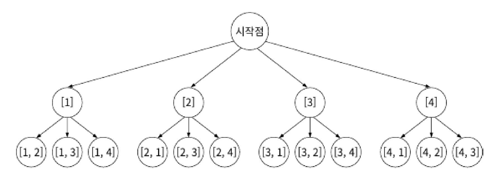

# 백트래킹
DFS와 BFS 등 데이터를 전부 확인하는 완전 탐색은 모든 경우의 수를 탐색해야 하므로 대부분의 경우 비효율적입니다. 어떤 가능성이 없는 곳을 알아보고 되돌아간다면 시간을 절약할 수 있겠죠? 이러한 방식을 백트래킹(backtracking)이라고 합니다.  
백트래킹 알고리즘은 문제마다 효율이 달라지기 때문에 시간 복잡도를 특정하기 어렵습니다. 하지만 솔루션이 될 수 없는 탐색 대상을 배제할 수 있으므로 적어도 완전 탐색보다는 효율적입니다.  
## 유망 함수
백트래킹의 핵심은 *해가 될 가능성의 판단*입니다. 이를 위해서 **유망 함수**(promising function)라는 함수를 정의하여 판단합니다. 유망 함수는 해가 될 가능성을 판단하기 위한 특정 조건을 의미합니다.  
전체적으로 백트래킹 알고리즘은 아래의 과정을 따라 진행됩니다.
1. 유효한 해의 집합을 정의한다.
2. 1에서 정의한 집합을 *그래프로* 표현한다.
3. 유망 함수를 정의한다.
4. 백트래킹 알고리즘을 활용해서 해를 찾는다.

### 합이 6을 넘는 경우 알아보기
간단한 예제를 통해 백트래킹 알고리즘의 과정을 알아보겠습니다. 수열 $\left[1,2,3,4\right]$ 중 2개의 수를 뽑아서 그 합이 6을 초과하는 경우를 알아내는 문제를 풀어보죠. 참고로, 뽑는 순서가 다르면 다른 경우의 수로 간주하겠습니다. 이를테면 $\left[1, 4\right]$와 $\left[4, 1\right]$의 합은 5로 동일하지만 서로 다른 경우의 수로 보는 것이죠.  
1. 유효한 해의 집합을 정의합니다. 서로 다른 두 수를 뽑는 경우의 수는 총 12개가 나옵니다. $\left[1, 2\right]$, $\left[1, 3\right]$, $\cdots$, $\left[4, 2\right]$, $\left[4, 3\right]$이 나옵니다.
2. 정의한 해의 집합을 그래프로 표현합니다.<br/>  
3. 그래프에서 백트래킹을 수행합니다. 여기서는 **처음에 뽑은 숫자가 3 미만이면 백트래킹한다**는 전략을 사용합니다. 1과 2를 처음에 뽑으면 이후에 어떤 경로로 가도 원하는 답이 나올 수 없기 때문입니다. 따라서 1과 2는 아예 탐색을 시도하지 않을 겁니다. 이것이 이 문제의 유망 함수가 되는 셈이죠.
4. 1, 2는 유망 함수와 관계 없이 DFS에 의해 방문은 합니다. 하지만 답이 아니기 때문에 백트래킹합니다. 그 이후 3과 4의 노드는 유망 함수를 통과하는 조합이므로 순서대로 탐색을 진행하면 됩니다.  

## 백트래킹 예제
백트래킹은 내용 그 자체가 어렵지는 않습니다. 그래서 이론을 파고들기 보다는 대표적인 예제를 살펴보며 개념을 익히는 게 좋습니다.
### 부분 집합 합
Sum of subset. 1부터 N까지 숫자를 조합했을 때 합이 K가 되는 조합을 찾는 문제입니다.
#### 완전 탐색 시
이 문제를 완전 탐색으로 풀 경우, 각 숫자는 뽑는 상태와 뽑지 않는 상태라는 2가지 상태를 갖습니다. 또한 각 숫자를 선택하는 과정은 다른 숫자에 대한 선택에 영향을 미치지 않습니다. 따라서 N개의 숫자를 뽑는 경우의 수는 $2^N$이므로 시간 복잡도는 $O\left(2^N\right)$입니다.  
답이 될 가능성이 없는 조합에 대해서도 탐색을 진행하기 때문에 문제에 따라 비효율적일 수 있습니다.
#### 백트래킹 시
그렇다면 백트래킹을 이용해 답이 될 가능성이 없는 조합에 대해서는 탐색을 진행하지 않도록 해보죠. 유망 함수는 다음과 같이 설계할 수 있을 겁니다.
- 조건 1: 현재 조합으로 합이 K가 되면 더 이상 탐색하지 않는다.
- 조건 2: 해당 숫자를 조합해 합이 K 이상이 되면 더 탐색하지 않는다.

1. 실제로 어떤 상황에서 유망 함수가 백트래킹시키는지 다시 생각해봅시다. 2나 3을 뽑으면 이미 합이 5이므로 수를 더 뽑지 않습니다. *조건 1*에 맞으니 백트래킹합니다. 반대로 1, 2를 뽑은 상태에서 3을 뽑으면 6이므로 5보다 크니 조건 2를 만족해서 백트래킹합니다.<br/>
2. 이렇게만 생각해도 탐색을 배제할 수 있는 노드가 많아집니다.<br/>

> **Tip**<br/>유망 함수는 같은 문제에서도 다양하게 정의할 수 있습니다. 문제를 푸는 사람에 따라 다르게 정의할 수 있고, 유망 함수를 어떻게 설계하느냐에 따라 성능을 더 개선할 수도 있습니다. 이 문제만 하더라도 **1에서 3까지 조합에서 합이 0이었다면 4를 볼 필요도 없다는 것을 추가로 알게 되었을 겁니다**. ~~그걸 코드로 구현하는 건 좀 다른 문제이긴 합니다~~<br/>  

예를 들어, 합이 10이 되는 조합을 구하는 문제는 다음과 같이 코드를 작성해 해결할 수 있습니다.  
```Python
def solution(n):
    answer = []

    def backtrack(sum, selected_nums, start):
        # 합이 10이 되면 답안에 추가
        if sum == 10:
            results.append(selected_nums)
            return
        # 다음에 선택할 수 있는 숫자들을 하나씩 선택하면서
        for i in range(start, n + 1):
            # 선택한 숫자의 합이 10보다 작거나 같으면
            if sum + i <= 10:
                # 백트래킹 함수를 재귀적으로 호출
                backtrack(
                    sum + i, selected_nums + [i], i + 1
                )
    
    backtrack(0, [], 1)
    return answer
```  
### N-퀸 문제
또다른 대표적인 백트래킹 문제는 N-퀸(N-Queen) 문제입니다. 체스의 퀸을 $N\times N$ 체스판에 $N$개 배치했을 때 서로를 공격할 수 없는 위치에 놓을 수 있는 방법이 있는지 찾는 문제입니다. 퀸의 이동 경로에 다른 퀸이 있다면 공격해서 제거할 수 있으니, 그렇게 되지 않도록 퀸을 배치하는 문제입니다.  
#### 완전 탐색 시
퀸을 놓을 수 있는 경우의 수를 모두 탐색해보죠. 각 줄에 퀸을 놓는 방법이 총 $N$개이므로 시간 복잡도는 $O\left(N^2\right)$입니다. 예를 들어, 체스판의 크기가 $4\times 4$라면 다음과 같은 그래프를 생각할 수 있습니다.  
  
그림은 퀸을 $\left(1, 1\right)$, $\left(2, 3\right)$, $\left(3, 2\right)$, $\left(4, 1\right)$에 놓은 것과 대응하는 그래프의 탐색 경로를 표시한 것입니다. 그래프 상의 모든 경우의 수를 다 탐색할 수는 있겠지만, 매우 비효율적인 것이 보이죠? 예를 들어 $\left(3, 2\right)$에 놓은 퀸은 $\left(2, 3\right)$과 대각선 상에 놓이므로 애초에 그 이후는 탐색할 필요도 없습니다. 그럼 이 부분을 유망 함수로 설정해 백트래킹을 실행하면 되겠네요!  
#### 백트래킹 시
유망 함수를 아래와 같이 정의해 보겠습니다.  
- 여왕이 추가될 때마다, 행 또는 대각선 방향에 겹치는 여왕이 있으면 탐색을 멈춘다.  
  
그리고 단계에 따라 문제를 풀면 됩니다.
1. 유효한 해의 집합을 정의합니다.
2. 해의 집합을 그래프로 변환합니다.
3. 앞서 본 사진처럼 백트래킹을 실시합니다.
4. 유망 함수를 통과하여 탐색하는 경우는 다음과 같습니다. X로 표시한 것들은 2, 4, 1, 3이 N-퀸 조건에 맞는지 확인하는 과정에서 유망 함수에 의해 백트래킹된 것입니다.<br/>  

이를 코드로 구현하면 아래와 같습니다.  
```Python
def getAns(n, y, width, diagonal1, diagonal2):
    ans = 0
    # 모든 행에 대하여 퀸의 위치가 결정되었을 경우
    if y == n:
        # 정답에 1 증가
        ans += 1
    else:
        # 현재 행에서 퀸이 놓일 수 있는 모든 위치를 시도
        for i in range(n):
            # 해당 위치에 이미 퀸이 있는 경우는 건너뛰기
            if width[i] or diagonal1[i + y] or diagonal2[i - y + n]:
                continue

            # 해당 위치에 퀸을 놓음
            width[i] = diagonal1[i + y] = diagonal2[i - y + n] = True
            # 다음 행으로 이동하여 재귀적으로 해결 가능한 경우의 수 찾기
            ans += getAns(n, y + 1, width, diagonal1, diagonal2)
            # 해당 위치에 놓인 퀸을 제거
            width[i] = diagonal1[i + y] = diagonal2[i - y + n] = False
    return ans


def solution(n):
    ans = getAns(n, 0, [False] * n, [False] * (n * 2), [False] * (n * 2))
    return ans
```