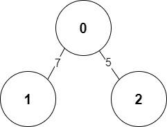

# 그래프 개념
그래프(graph)는 노드(node, 정점(vertex)라고도 함)와 간선(edge)을 이용한 비선형 데이터 구조입니다. 그래프는 주로 데이터 간의 관계를 표현하는 데 사용합니다. 각각의 데이터를 노드로, 노드 간의 관계와 흐름을 간선으로 표현합니다. 또한 관계의 정도를 표현할 필요가 있다면 가중치라는 개념을 추가해 표현합니다.
## 그래프의 특징과 종류
그래프는 방향성, 가중치, 순환성에 따라 종류가 구분됩니다.
### 방향성
간선에는 방향이 있을 수도 있고 없을 수도 있습니다. 간선에 방향이 있는 그래프를 방향 그래프(directed graph), 그렇지 않다면 무방향 그래프(undirected graph)라고 합니다.  
방향 그래프에서는 어느 한쪽으로만 간선이 있는 것이 아니라 서로 반대를 가리키는 간선이 있을 수도 있습니다.
### 가중치
어떤 데이터는 흐름의 방향뿐 아니라 그 방향으로 흘러가는 양도 중요합니다. 그 양의 정도를 간선에 표현한 것이 가중치(weight)입니다. 가중치를 갖는 그래프를 가중치 그래프(weight graph)라고 합니다.
### 순환성
순환이란 특정 노드에서 시작해 간선을 따라 다시 돌아오는 경로가 있다는 뜻입니다. 순환이 존재하는 그래프를 순환 그래프(cycle graph)라 하고, 순환이 존재하지 않는 그래프를 비순환 그래프(acyclic graph)라고 합니다.

## 그래프의 구현
그래프를 구현하는 방식에는 **인접 행렬**(adjacency matrix)과 **인접 리스트**(adjacency list)가 있습니다. 각각의 방식을 설명하기 위해 아래 그림과 같은 그래프를 예시로 설명하겠습니다.  
  
위 그래프에서 각 노드와 간선의 관계를 표로 나타내면 아래와 같습니다.  

<table>
	<tbody>
		<tr>
			<td>&nbsp;</td>
			<td><strong>0</strong></td>
			<td><strong>1</strong></td>
			<td><strong>2</strong></td>
		</tr>
		<tr>
			<td><strong>0</strong></td>
			<td>0</td>
			<td>7</td>
			<td>5</td>
		</tr>
		<tr>
			<td><strong>1</strong></td>
			<td>7</td>
			<td>0</td>
			<td>무한</td>
		</tr>
		<tr>
			<td><strong>2</strong></td>
			<td>5</td>
			<td>무한</td>
			<td>0</td>
		</tr>
	</tbody>
</table>  

### 인접 행렬 방식
인접 행렬 방식은 2차원 배열에 각 노드가 연결된 형태를 기록하는 방식입니다. 파이썬의 경우 2차원 리스트로 구현할 수 있겠죠? 연결된 노드끼리의 가중치를 해당 행과 열의 위치에 저장합니다. 예를 들어 0번 노드에서 1번 노드로 가는 간선의 가중치가 7이라 하면 0행 1열 인덱스의 값은 7이 됩니다. 연결이 되어 있지 않은 노드들 간의 값은 무한으로 설정합니다. 실제로는 적당히 큰 값(예를 들어 999999999 등)을 무한으로 설정해서 초기화합니다. 또한 자기 자신에 대한 값은 0으로 취급합니다.  
```Python
INF = 999999999 # 무한대의 비용

graph = [
    [0, 7, 5],
    [7, 0, INF],
    [5, INF, 0]
]

print(graph)
```

### 인접 리스트 방식
인접 리스트로 그래프를 표현할 때는 적절한 노드를 정의해야 합니다. 하나의 노드에 값, 가중치, 다음 노드의 정보를 묶어서 저장합니다. 트리에서 포인터를 이용하는 방식을 봤다면 익숙할 수 있을 겁니다.  
컴퓨터과학에서 이론상 인접 리스트는 *연결 리스트*라는 자료구조를 사용하는데, 파이썬의 리스트가 바로 이 연결 리스트에 적합합니다. 그러니 우리는 다른 추가 조치 없이 2차원 리스트를 사용하면 구현할 수 있습니다.  
인접 리스트 방식은 아래의 과정으로 동작합니다.  
1. 노드 개수만큼 배열을 준비한다.
2. 배열의 인덱스는 각 시작 노드를 의미하며, 배열의 값에 다음 노드를 연결한다.  

```Python
# 행이 3개인 2차원 리스트로 인접 리스트 표현
graph = [[] for _ in range(3)]

# 노드 0에 연결된 노드 정보 저장(노드, 거리)
graph[0].append((1, 7))
graph[0].append((2, 5))

# 노드 1에 연결된 노드 정보 저장(노드, 거리)
graph[1].append((0, 7))

# 노드 2에 연결된 노드 정보 저장(노드, 거리)
graph[2].append((0, 5))

print(graph)
```  

### 두 구현 방식의 비교
메모리 측면에서는 인접 리스트 방식이 앞섭니다. 왜냐하면 인접 행렬 방식에는 간선의 유무와 무관하게 모든 노드의 관계를 저장하기 때문이죠. 노드가 많아질수록 낭비되는 메모리도 많아질 가능성이 높습니다. 반면 인접 리스트는 연결된 정보만 저장하기 때문에 메모리 면에서 효율적입니다.  
반대로 시간적인 측면에서는 인접 행렬이 더 효율적입니다. 앞서 인접 리스트가 연결된 정보만 저장한다는 특성이 여기서는 반대로 작용합니다. 특정한 두 노드가 연결되어 있는지에 대한 정보를 얻으려면 리스트를 다 뒤져야 하기 때문이죠.  
표로 정리하면 아래와 같습니다.  

||인접 행렬|인접 리스트|
|---|---|---|
|메모리 사용|$O\left(N^2\right)$|$O\left(N^2\right)$|
|시간 복잡도|$O\left(1\right)$|$O\left(N\right)$|
|기타|구현이 상대적으로 쉬움|-|  

코딩 테스트에서는 보통 주어진 시간 안에 구현을 하기 위해 인접 행렬 방식으로 그래프 문제를 푸는 경우가 많습니다. 다만, 노드 개수가 1000개 미만으로 주어지는 경우에만 인접 행렬이 효율적입니다.

# 그래프 탐색
탐색(search)은 많은 양의 데이터 중 자신이 원하는 데이터를 찾는 작업입니다. 대표적인 탐색 알고리즘으로는 DFS와 BFS를 꼽을 수 있습니다. 그리고 이 두 가지 알고리즘을 잘 이해해야만 코딩 테스트의 탐색 문제를 풀 수 있습니다.  

> DFS와 BFS를 제대로 이해하기 위해서는 **스택과 큐 자료구조에 대한 이해가 선행되어야 합니다**.  

스택과 큐를 사용할 때는 삽입과 삭제를 구현하는 것뿐만 아니라 오버플로(overflow)와 언더플로(underflow)를 고려해야 합니다. 오버플로는 자료구조가 수용할 수 있는 데이터의 크기를 넘어서 데이터가 넘쳐흐르는 상황입니다. 반대로 언더플로는 자료구조에 데이터가 전혀 들어있지 않은 상태에서 삭제를 수행했을 때 발생하는 상황입니다. 파이썬에서 이 두 자료구조를 구현할 때는 굳이 자료구조의 크기를 지정하지 않아도 동적으로 크기를 지정하기 때문에 오버플로 문제는 잘 발생하지 않습니다. 오히려 알고리즘을 코드로 옮길 때 실수가 생겨서 빈 자료구조에서 데이터를 꺼내려하면 언더플로에 더 신경을 써야 합니다. 

## 재귀 함수
DFS와 BFS를 구현할 때는 재귀 함수(recursive function)도 알아두는 것이 좋습니다. 재귀 함수란 **자기 자신을 다시 호출하는 함수**를 뜻합니다. 따로 조건을 주지 않는 한 무한히 재귀 함수가 호출되기 때문에, 웬만한 프로그래밍 언어에는 재귀의 *최대 깊이*라는 것을 지정합니다. 쉽게 말해 재귀 함수의 호출 제한 횟수라고 보면 됩니다. 재귀 최대 깊이를 차치하더라도, 일반적으로 무한 호출 상황을 방지하기 위해 재귀 함수에 종료 조건을 걸어줍니다.  
재귀 함수의 대표적인 예로 팩토리얼(factorial) 문제가 있습니다. 수학에서 팩토리얼은 느낌표($!$)로 표시하며 아래와 같이 정의합니다.  
$$n! = 1\times 2\times\cdots \left(n-1\right)\times n$$  
수학적으로 $0!=1!=1$이라는 성질이 있습니다. 이 성질을 종료 조건으로 삼으면 팩토리얼을 재귀 함수로 구현할 수 있습니다.  
```Python
def factorial(n):
    if n <= 1:
        return 1
    return n * factorial(n - 1)
```  
재귀 함수의 코드가 이렇게 간결한 이유는 수학의 점화식(재귀식)을 코드로 옮긴 것이기 때문입니다. 점화식의 개념은 이후 *다이나믹 프로그래밍*에서도 다시 등장하고 중요하게 사용됩니다.  
## DFS
Depth-First Search. 깊이 우선 탐색이라는 뜻입니다. 그래프에서 깊은 부분을 우선적으로 탐색하는 알고리즘입니다.  
DFS에서는 시작 노드부터 탐색을 시작해 간선을 따라 최대 깊이 노드까지 이동하며 방문합니다. 최대 깊이 노드까지 방문한 후에는 이전에 방문한 노드를 거슬러 올라가며 해당 노드와 연결된 노드 중 방문하지 않은 노드로 다시 최대 깊이까지 차례대로 방문합니다. 핵심은 **가장 깊은 노드까지 방문 후에 더 이상 방문할 노드가 없으면 최근 방문한 노드로 돌아온 다음, 해당 노드에서 방문할 노드가 있는지 확인**하는 것입니다.  
DFS는 **스택** 자료구조를 이용합니다. 구체적인 절차는 아래와 같습니다.  
1. 시작 노드를 결정한 후 스택에 시작 노드를 푸시한다.
2. 스택이 비었는지 확인하고, 비어있으면 탐색을 종료한다.
3. 스택에서 노드를 팝한다.
4. 팝한 노드의 방문 여부를 확인하고, 아직 방문하지 않았다면 방문 처리한다.
5. 방문한 노드와 인접한 모든 노드를 확인해 그 중 아직 방문하지 않은 노드를 스택에 푸시한다.  

여기서 탐색하고 있는 방향의 반대 방향으로 돌아가는 동작이 있죠? 이 동작을 **백트래킹**(backtracking)이라고 합니다. 스택은 최근에 푸시한 노드부터 팝하기 때문에 특정 노드를 방문하기 전에 최근 방문 노드를 팝 연산으로 확인할 수 있습니다.  
DFS가 스택을 이용한다는 알고리즘을 고려하면 재귀 함수를 이용해 간결하게 구현할 수 있습니다.  
```Python
def dfs(graph, v, visited):
    # 현재 노드를 방문 처리
    visited[v] = True
    print(v, end=' ')
    # 현재 노드와 연결된 다른 노드를 재귀적으로 방문
    for i in graph[v]:
        if not visited[i]:
            dfs(graph, i, visited)
# 각 노드가 연결된 정보를 리스트 자료형으로 표현(2차원 리스트)
graph = [
    [],
    [2, 3, 8],
    [1, 7],
    [1, 4, 5],
    [3, 5],
    [3, 4],
    [7],
    [2, 6, 8].
    [1, 7]
]
# 각 노드의 방문 여부를 리스트 자료형으로 표현(1차원 리스트)
visited = [False] * 9
# 정의된 dfs 함수 호출
dfs(graph, 1, visited)
```  
## BFS
Breadth First Search. 너비 우선 탐색으로, 시작 노드로부터 가장 가까운 노드부터 탐색하는 알고리즘입니다. 여기서 거리는 시작 노드와 목표 노드까지의 차수입니다(트리에서 말했던 그 차수와 같은 뜻입니다!).  
최대한 먼 노드부터 탐색하는 DFS와 반대로 BFS는 가장 가까운 노드부터 탐색하는 특성으로 인해 스택 대신 **큐**를 이용해 구현합니다.  
1. 시작 노드를 결정한 후 큐에 시작 노드를 푸시한다.
2. 큐가 비었는지 확인하고, 비어있으면 탐색을 종료한다.
3. 큐에서 노드를 팝한다.
4. 팝한 노드와 인접한 모든 노드를 확인해 그 중 아직 방문하지 않은 노드를 큐에 푸시하고 방문 처리한다.  
```Python
from collections import deque

def bfs(graph, start, visited):
    queue = deque([start])
    # 현재 노드를 방문 처리
    visited[start] = True
    # 큐가 빌 때까지 반복
    while queue:
        # 큐에서 원소 하나를 뽑아서 출력
        v = queue.popleft()
        print(v, end=' ')
        # 해당 원소와 연결된, 아직 방문하지 않은 원소들을 큐에 삽입
        for i in graph[v]:
            if not visited[i]:
                queue.append(i)
                visited[i] = True

# 각 노드가 연결된 정보를 리스트 자료형으로 표현(2차원 리스트)
graph = [
    [],
    [2, 3, 8],
    [1, 7],
    [1, 4, 5],
    [3, 5],
    [3, 4],
    [7],
    [2, 6, 8].
    [1, 7]
]

# 각 노드의 방문 여부를 리스트 자료형으로 표현(1차원 리스트)
visited = [False] * 9
# 정의된 bfs 함수 호출
bfs(graph, 1, visited)
```

## DFS vs. BFS
두 알고리즘의 차이를 비교하기 전에 알고리즘의 차이를 짚고 가야 합니다.  
깊이 우선 탐색은 **깊게 탐색 후 시작 노드로 되돌아옵니다.** 더 이상 탐색할 수 없으면 백트래킹을 수행해 최근 방문 노드부터 다시 탐색을 진행합니다. 따라서 백트래킹 알고리즘을 구현하거나 그래프의 사이클을 감지할 때 활용할 수 있습니다. 최단 경로를 찾는 문제가 아니라면 DFS를 우선적으로 고려하는 것이 좋다고 합니다.    
너비 우선 탐색은 **가중치가 없는 그래프에서 최단 경로를 보장합니다.** 시작 노드로부터 간선을 통해 직접 연결된 모든 노드를 먼저 방문하기 때문이죠. 이 때문에 문제의 답이 여러 개인 경우 가장 가까운 답을 찾을 때 유용합니다. 이를 활용하면 미로 찾기 문제의 최단 경로를 찾거나, 네트워크 분석 문제에 활용할 수 있다고 합니다.  
일반적으로 실제 수행 시간은 DFS보다 BFS가 상대적으로 덜 걸립니다.

# 그래프 최단 경로
최단 경로(shortest path) 문제는 가장 짧은 경로를 찾는 알고리즘입니다. 그러나 이 해석은 주어진 그래프의 종류에 따라 다르게 볼 수 있습니다. 가중치가 없는 그래프에서는 간선 개수가 가장 적은 경로가 최단 경로일 겁니다. 반대로 가중치가 있는 그래프는 일반적으로 시작 노드에서 끝 노드까지 이동할 때 거치는 간선의 가중치의 총합이 최소가 되는 것을 말합니다. 일반적으로 코딩 테스트에서는 최단 경로를 모두 출력하라는 문제보다는 최단 거리만 출력하라고 요구하는 경우가 많습니다.  
## 다익스트라 알고리즘
가중치가 있는 그래프의 최단 경로를 구하는 문제에서는 대부분 다익스트라 알고리즘(Dijkstra algorithm)을 사용한다고 봐도 됩니다. 그만큼 이 알고리즘이 중요한 알고리즘이라는 반증이죠. 현실에서도 GPS 소프트웨어의 기본 알고리즘으로 채택되곤 합니다.  
다익스트라 알고리즘은 기본적으로 *그리디 알고리즘*의 일종으로 분류됩니다. 가장 비용이 적은 노드를 선택해서 임의의 과정을 반복하기 때문입니다.
동작 방식은 아래와 같습니다.  
1. 시작 노드를 설정하고 시작 노드로부터 특정 노드까지의 최소 비용을 저장할 1차원 리스트(최단 거리 테이블)과 직전 노드를 저장할 공간을 마련한다.
    1. 최소 비용을 저장할 공간을 무한대(infinity, INF라는 약자로 표기)로 초기화. 실제로는 매우 큰 값으로 초기화한다. 직전 노드를 저장할 공간도 INF로 초기화.
    2. 시작 노드의 최소 비용은 0, 직전 노드는 자기 자신으로 설정한다.
2. 해당 노드를 통해 방문할 수 있는 노드 중, 즉 아직 방문하지 않은 노드 중 현재까지 구한 최소 비용이 가장 적은 노드를 선택한다.
    1. 해당 노드를 거쳐서 각 노드까지 가는 최소 비용과 현재까지 구한 최소 비용을 비교하여 작은 값을 각 노드의 최소 비용으로 갱신한다.
    2. 이때 직전 노드도 같이 갱신한다.
3. 노드 개수에서 1을 뺀 만큼 반복한다.

> **음의 가중치가 있는 그래프의 경우는?**<br/>**다익스트라 알고리즘은 양의 가중치만 있는 그래프에서만 동작합니다.** 따라서 음의 가중치가 있는 그래프에서는 제대로 동작하지 않습니다. 그럼에도 불구하고 다익스트라 알고리즘을 많이 사용하는 이유는 대부분의 경우 음의 가중치를 갖는 그래프가 없고, 성능도 매우 뛰어나기 때문입니다.  

-----------
다익스트라 알고리즘을 구현하는 방법은 2가지가 있습니다. 하나는 이 알고리즘을 만들어낸 에츠허르 다익스트라 교수가 최초로 발표한 간단한 다익스트라 알고리즘이고, 다른 하나는 힙 자료구조를 이용해 성능을 개선한 알고리즘입니다.  
### 구현 방식 1
간단한 다익스트라 알고리즘은 $O\left(V^2\right)$의 시간 복잡도를 갖습니다. 여기서 $V$는 노드의 개수입니다.  
처음에 각 노드에 대한 최단 거리를 담는 1차원 리스트를 선언합니다. 이후 **단계마다 방문하지 않은 노드 중 최단 거리가 가장 짧은 노드를 선택하기 위해 매 단계마다 1차원 리스트의 모든 원소를 확인(순차 탐색)**합니다.  
```Python
import sys
input = sys.stdin.readline
INF = int(1e9)

# 노드의 개수, 간선의 개수 입력
n, m = map(int, input().split())
# 시작 노드 번호 입력
start = int(input())
# 각 노드에 연결되어 있는 노드를 리스트에 저장
graph = [[] for _ in range(n + 1)]
# 방문 여부 리스트
visited = [False] * (n + 1)
# 최단 거리 테이블을 무한으로 초기화
distance = [INF] * (n + 1)

for _ in range(m):
    a, b, c = map(int, input().split()) # 시작 노드, 도착 노드, 비용
    graph[a].append((b, c))

# 방문하지 않은 노드 중에서, 가장 최단 거리가 짧은 노드 번호 반환
def get_smallest_node():
    min_value = INF
    index = 0
    for i in range(1, n + 1):
        if distance[i] < min_value and not visited[i]:
            min_value = distance[i]
            index = i
    return index

def dijkstra(start):
    distance[start] = 0
    visited[start] = True
    for j in graph[start]:
        distance[j[0]] = j[1]
    # 시작 노드를 제외한 전체 n - 1개의 노드에 대해 반복
    for i in range(n - 1):
        # 현재 최단 거리가 가장 짧은 노드를 꺼내서 방문 처리
        now = get_smallest_node()
        visited[now] = True
        # 현재 노드와 연결된 다른 노드를 확인
        for j in graph[now]:
            cost = distance[now] + j[i]
            # 현재 노드를 거쳐서 다른 노드로 이동하는 거리가 더 짧은 경우
            if cost < distance[j[0]]:
                distance[j[0]] = cost

# 다익스트라 알고리즘 수행
dijkstra(start)

# 모든 노드로 가기 위한 최단 거리 출력
for i in range(1, n + 1):
    if distance[i] == INF:
        print("INFINITY")
    else:
        print(distance[i])
```  
### 구현 방식 2
앞서 설명한 단순한 다익스트라 알고리즘은 $O\left(V^2\right)$의 시간 복잡도를 갖습니다. 하지만 이번에 소개할 방식은 $O\left(E\log V\right)$의 시간 복잡도가 보장됩니다. 여기서 $V$는 노드의 개수, $E$는 간선의 개수를 의미합니다.  
간단한 다익스트라 알고리즘은 *최단 거리가 가장 짧은 노드*를 찾기 위해서, 매번 최단 거리 테이블을 선형적으로(모든 원소를 앞에서부터 하나씩) 탐색해야 했습니다. 이 과정에서만 $O\left(V\right)$가 걸렸죠. 개선된 알고리즘은 이 부분의 시간 복잡도를 줄이는 것에 목표를 둡니다. 최단 거리가 가장 짧은 노드를 단순히 선형적으로 찾는 것이 아니라 더 빨리 찾는 것이죠. 이를 위해서 힙(Heap) 자료구조를 도입합니다.  
#### 힙 자료구조
힙은 우선순위 큐(priority queue)를 구현하기 위해 사용하는 자료구조입니다. 일반적인 큐 자료구조가 가장 먼저 삽입된 데이터를 가장 먼저 추출하는 반면, 우선순위 큐는 **우선순위가 가장 높은 데이터를 가장 먼저 추출**합니다. 데이터를 우선순위에 따라 처리하고 싶을 때 사용하는 것입니다.  
파이썬을 포함한 대부분의 프로그래밍 언어에서는 우선순위 큐 라이브러리를 지원하기 때문에 일반적으로 코딩 테스트를 보다가 우선순위 큐를 구현할 일은 없을 것입니다. 파이썬에서는 `PriorityQueue` 혹은 `heapq`를 사용해서 구현하는데, 일반적으로 `heapq`가 동작 속도가 더 빠르기 때문에 이를 추천합니다.  
데이터의 우선순위 값은 보통 정수형 변수가 사용됩니다. 대부분의 프로그래밍 언어에서는 우선순위 큐에 데이터의 묶음을 넣으면, 첫 번째 원소를 기준으로 우선순위를 설정합니다. 데이터가 `(가치, 물건)`으로 구성된다면 '가치' 값이 우선순위에 해당하는 것이죠. 파이썬에서도 마찬가지입니다.  
또한 우선순위 큐를 구현할 때는 내부적으로 최소 힙(min heap)과 최대 힙(max heap)을 이용합니다. 최소 힙을 이용할 때는 *값이 낮은 데이터가 먼저 추출*되고, 최대 힙에서는 반대로 *값이 높은 데이터가 먼저 추출*됩니다. 파이썬 라이브러리에서는 기본적으로 최소 힙 구조를 사용합니다. 다익스트라 최단 경로 알고리즘에서는 비용이 적은 노드를 우선 방문하므로 이 라이브러리를 그대로 사용하면 됩니다.  
참고로 최소 힙은 최대 힙처럼 사용하기 위해 한 가지 테크닉을 적용하기도 합니다. 우선순위 값에 음수 부호를 붙여서 넣으면 최대 힙처럼 사용할 수 있겠죠? 이렇게 우선순위 큐에서 꺼낸 후에 다시 음수 부호를 붙여서 원래 값으로 되돌리기만 하면 됩니다.  
이러한 힙 자료구조는 데이터 삽입과 삭제에 모두 $O\left(\log N\right)$가 소모됩니다. 따라서 $N$개의 데이터를 모두 넣은 뒤에 도로 꺼낼 경우 총 연산 횟수는 $2N\log_2 N$이 소모되고 빅오 표기법에 따라 시간 복잡도는 $O\left(N\log N\right)$이 될 것입니다.  

-------------
그래서 이를 이용해 다시 작성한 다익스트라 알고리즘은 다음과 같이 구현할 수 있습니다.  
```Python
import heapq
import sys
input = sys.stdin.readline
INF = int(1e9)

# 노드의 개수, 간선의 개수 입력
n, m = map(int, input().split())
# 시작 노드 번호 입력
start = int(input())
# 각 노드에 연결되어 있는 노드를 리스트에 저장
graph = [[] for _ in range(n + 1)]
# 방문 여부 리스트
visited = [False] * (n + 1)
# 최단 거리 테이블을 무한으로 초기화
distance = [INF] * (n + 1)

for _ in range(m):
    a, b, c = map(int, input().split()) # 시작 노드, 도착 노드, 비용
    graph[a].append((b, c))

def dijkstra(start):
    q = []
    # 시작 노드로 가기 위한 최단 경로는 0으로 설정하며, 큐에 삽입
    heapq.heappush(q, (0, start))
    distance[start] = 0
    while q: # 큐가 비어있지 않다면
        # 가장 최단 거리가 짧은 노드에 대한 정보 꺼내기
        dist, how = heapq.heappop(q)
        # 현재 노드가 이미 처리된 적이 있는 노드라면 무시
        if distance[now] < dist:
            continue
        # 현재 노드와 연결된 다른 인접한 노드들을 확인
        for i in graph[now]:
            cost = dist + i[1]
            # 현재 노드를 거쳐서, 다른 노드로 이동하는 거리가 더 짧은 경우
            if cost < distance[i[0]]:
                distance[i[0]] = cost
                heapq.heappush(q, (cost, i[0]))

# 다익스트라 알고리즘 수행
dijkstra(start)

# 모든 노드로 가기 위한 최단 거리 출력
for i in range(1, n + 1):
    if distance[i] == INF:
        print("INFINITY")
    else:
        print(distance[i])
```

## 벨만-포드 알고리즘
다익스트라 알고리즘과 달리 벨만-포드 알고리즘(Bellman-Ford algorithm)은 음의 가중치를 가지는 그래프에서도 최단 경로를 구할 수 있습니다. 왜냐하면 매 단계마다 모든 간선의 가중치를 다시 확인하여 최소 비용을 갱신하기 때문입니다. 동작 방식은 아래와 같습니다.  
1. 시작 노드를 설정하고 다음 시작 노드의 최소 비용은 0, 나머지 노드는 INF로 초기화. 이후 최소 비용을 갱신할 때 직전 노드도 갱신한다.
2. 노드 개수 - 1회만큼 다음 연산을 반복한다.
    1. 시작 노드에서 갈 수 있는 각 노드에 대하여 전체 노드 각각을 거쳐갈 때 현재까지 구한 최소 비용보다 더 적은 최소 비용이 있는지 확인하여 갱신한다. 최소 비용을 갱신할 때, V의 직전 노드 값도 같이 갱신한다.
3. 과정 2를 마지막으로 한 번 더 수행하여 갱신되는 최소 비용이 있는지 확인한다. 만약 있다면 **음의 순환이 있다**는 신호이다.

### 노드 개수 - 1회만큼 반복하는 이유
매 연산마다 최단 경로가 1개씩 확정되기 때문입니다. N개의 노드가 있는 그래프에서 $N-1$번 연산을 반복하면 노드 $N$에 대한 최단 경로가 결정되어 벨만-포드 알고리즘이 끝나는 것입니다.

### 마지막에 한 번 더 연산을 수행하는 이유
노드 $N$의 최단 경로를 구성하는 간선 개수가 $N$개 이상이면 최단 경로의 간선 개수는 최대 $N-1$이어야 하므로 모순입니다. 따라서 음의 순환이 있다는 것을 알 수 있습니다. 앞서 예로 든 그래프에서 마지막 구간인 $\left(N-1\right)\rightarrow N$의 역방향인 $N\rightarrow \left(N-1\right)$ 간선이 있고 이 간선의 가중치가 음수라고 가정해보겠습니다. 그러면 음의 순환인 이 구간을 반복하면 계속해서 최소 비용(가중치의 합)이 줄어듭니다. 이러면 어떤 알고리즘을 사용해도 최단 경로를 구할 수 없습니다.  
그렇다고 해서 음의 순환에 빠지는 것을 벨만-포드 알고리즘의 한계로 볼 수는 없습니다. 다익스트라 알고리즘이 음의 가중치가 있는 그래프에서 아예 작동하지 못하는 것을 감안하면, 오히려 벨만-포드 알고리즘의 이러한 특성은 **음의 순환을 감지하는 능력이 있다**고 보는 편이 더 옳을 것입니다.
## 플로이드-워셜 알고리즘
다익스트라 알고리즘이 *한 지점에서 다른 특정 지점까지의 최단 경로를 구해야 하는 경우*에 사용할 수 있는 알고리즘이라면, 플로이드-워셜 알고리즘(Floyd-Warshall algorithm)은 **모든 지점에서 다른 모든 지점까지의 최단 경로를 모두 구해야 하는 경우**에 사용하는 알고리즘입니다.  
다익스트라 알고리즘은 단계마다 최단 거리를 가지는 노드를 하나씩 반복적으로 선택합니다. 그리고 해당 노드를 거쳐 가는 경로를 확인하며, 최단 거리 테이블을 갱신하는 방식으로 동작합니다. 단계마다 거쳐 가는 노드를 기준으로 알고리즘을 수행하는 것은 다익스트라 알고리즘과 동일하지만, 매번 방문하지 않은 노드 중에서 최단 거리를 갖는 노드를 찾을 필요가 없다는 점이 다릅니다. 노드가 $N$개일 때 알고리즘 상으로 $N$번의 단계를 수행하며, 각 단계마다 $O\left(N^2\right)$의 연산을 통해 '현재 노드를 거쳐가는' 모든 경로를 고려합니다. 따라서 플로이드-워셜 알고리즘의 총 시간 복잡도는 $O\left(N^3\right)$입니다.  
모든 노드에 대하여 다른 모든 노드로 가는 최단 거리 정보를 담아야 하기 때문에, 플로이드-워셜 알고리즘은 다익스트라 알고리즘과 달리 2차원 리스트에 '최단 거리' 정보를 저장한다는 특징이 있습니다. 앞서 각 단계마다 $O\left(N^2\right)$의 연산을 하는 것은 바로 이 2차원 리스트를 처리해야 하기 때문입니다.  
또한 다익스트라 알고리즘이 그리디 알고리즘인 것에 반해, 플로이드-워셜 알고리즘은 다이나믹 프로그래밍입니다. 노드의 개수만큼 반복하면서 '점화식에 맞게' 2차원 리스트를 갱신하기 때문입니다. 구체적으로 $K$번의 단계에 대한 점화식은 아래와 같습니다.  
$$D_{ab}=\min\left(D_{ab},\ D_{ak}+D_{kb}\right)$$  
풀어서 설명하자면, **A에서 B로 가는 최소 비용**과 **A에서 K를 거쳐 B로 가는 비용**을 비교하여 더 작은 값으로 갱신하는 것입니다. 즉, 바로 이동하는 거리가 특정한 노드를 거쳐서 이동하는 거리보다 더 많은 비용을 가진다면 이를 더 짧은 것으로 갱신하는 거죠. 따라서 전체적으로 3중 반복문을 이용해 이 점화식에 따라 최단 거리 테이블을 갱신하면 됩니다.  
```Python
INF = int(1e9)

# 노드의 개수, 간선의 개수 입력
n = int(input())
m = int(input())
# 2차원 리스트(그래프 표현)를 만들고, 모든 값을 무한으로 초기화
graph = [[INF] * (n + 1) for _ in range(n + 1)]

# 자기 자신에서 자기 자신으로 가는 비용은 0으로 초기화
for a in range(1, n + 1):
    for b in range(1, n + 1):
        if a == b:
            graph[a][b] = 0

# 각 간선에 대한 정보를 입력받아, 그 값으로 초기화
for _ in range(m):
    # A에서 B로 가는 비용은 C로 설정
    a, b, c = map(int, input().split())
    graph[a][b] = c

# 점화식에 따라 플로이드-워셜 알고리즘 수행
for k in range(1, n + 1):
    for a in range(1, n + 1):
        for b in range(1, n + 1):
            graph[a][b] = min(graph[a][b], graph[a][k] + graph[b][k])

# 수행된 결과를 출력
for a in range(1, n + 1):
    for b in range(1, n + 1):
        # 도달할 수 없는 경우, 무한(INFINITY)이라고 출력
        if graph[a][b] == INF:
            print("INFINITY", end = " ")
        # 도달할 수 있는 경우 거리를 출력
        else:
            print(graph[a][b], end = " ")
    print()
```