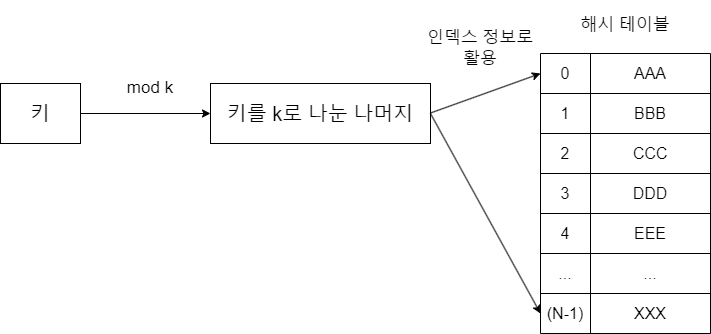
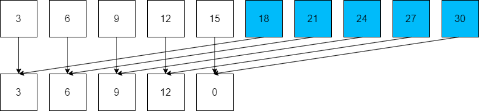

# 해시 개념
어떠한 값이 저장되는 위치를 어떤 규칙으로 정할 수 있다면 굳이 탐색을 할 필요 없이 바로 데이터를 찾아낼 수 있을 겁니다. 해시(Hash)는 이러한 생각을 바탕으로 만들어진 자료구조입니다. 해시는 **해시 함수를 사용해서 변환한 값을 인덱스로 삼아 키와 값을 저장해서 빠른 데이터 탐색을 제공하는 자료구조**입니다. 어떻게 탐색을 빠르게 만들까요? 보통은 인덱스를 활용해서 탐색을 빠르게 만들지만 해시는 키(key)를 활용해 데이터 탐색을 빠르게 합니다.  
> 해시는 키와 데이터를 일대일 대응하여 저장하므로 키를 통해 데이터에 바로 접근할 수 있습니다. 사람에게는 숫자(인덱스)로 데이터를 관리하는 배열보다 조금 더 접근성이 좋은 자료구조입니다.  

## 해시 자세히 알아보기
실생활에서 가장 쉽게 볼 수 있는 해시의 예는 연락처입니다. 내가 얻고자 하는 정보, 즉 전화번호는 **값**(value)이고, 값을 검색하기 위해 활용하는 정보는 **키**(key)입니다. 그리고 그 사이에 키를 이용해 해시값 또는 인덱스로 변환하는 해시 함수가 있습니다. 해시 함수는 이렇게 일정한 키를 일정한 해시값으로 변환시켜 값을 찾을 수 있게 해줍니다. 해시 함수에 대한 건 아래에서 다시 자세하게 설명하고, 여기서는 이런 식으로 동작한다는 컨셉과 동작만 알아보겠습니다.

## 해시의 특징
1. 해시는 단방향으로 작동합니다. 키를 통해 값을 찾을 수는 있지만, 반대로 값을 통해 키를 찾을 수는 없습니다. 이러한 특징 때문에 외부에 정보를 안전하게 제공한다는 특징이 있어 네트워크 보안에서 많이 활용됩니다.
2. 찾고자 하는 값을 $O\left(1\right)$에서 바로 찾을 수 있습니다. 키 자체가 해시 함수에 의해 값이 있는 인덱스가 되므로, 값을 찾기 위한 탐색 과정이 필요 없습니다.
3. 값을 인덱스로 활용하려면 적절한 변환 과정을 거쳐야 합니다.  
### 해시를 사용하지 않으면 어떻게 될까?
해시를 사용하지 않는다면 우리는 값의 위치에 대한 어떤 정보도 알 수 없을 겁니다. 그래서 어떤 데이터를 찾으려면 전체 데이터를 확인해보는 방법 밖에는 없을 겁니다.  
반면 해시를 사용하면 순차 탐색할 필요가 없이 해시 함수를 활용해서 특정 값이 있는 위치를 바로 찾을 수 있어 탐색 효율이 좋습니다. 여기서 키와 대응한 값이 저장된 공간을 **해시 테이블**(hash table)이라 하며, 해시 테이블의 각 데이터를 **버킷**(bucket)이라고 부릅니다.  

## 해시의 특성을 활용하는 분야
해시는 단방향으로만 검색할 수 있는 대신 빠르게 원하는 값을 검색할 수 있습니다. 이런 해시의 특성은 데이터를 저장하고 검색하거나, 보안이 필요할 때 활용됩니다. 코딩 테스트에서는 특정 데이터를 탐색하는 횟수가 많을 경우 해시를 고려하면 좋습니다. 아래는 해시가 활용되는 실제 사례입니다.  
* 비밀번호 관리: 사용자의 비밀번호를 그대로 노출해 저장하는 것은 위험하므로 해시 함수를 활용해 해싱한 비밀번호를 저장합니다. 비밀번호가 맞는지 확인할 때도 마찬가지입니다. 사용자가 입력한 비밀번호를 해싱해 확인합니다.
* 데이터베이스 인덱싱: DB에 저장된 데이터를 효율적으로 검색할 때 해시를 활용합니다.
* 블록체인: 해시 함수가 핵심적인 분야입니다. 각 블록은 이전 블록의 해시값을 포함하고 있으며, 이를 통해 데이터 무결성을 확인할 수 있습니다.

# 해시 함수
해시 함수를 구현하는 방법을 알기 전에, 이를 구현할 때 고려해야 하는 점을 알아야 합니다. 사실 코딩 테스트에서 해시 함수를 직접 구현하라는 문제가 나오는 경우는 거의 없습니다. **그리고 파이썬의 딕셔너리 자료형은 해시와 거의 동일하게 작동하므로 해시를 쉽게 사용할 수 있습니다.** 하지만 해시의 원리를 이해하고 딕셔너리를 사용하면 좀 더 효율적으로 딕셔너리를 사용할 수 있으므로 한 번쯤은 해시 개념을 공부하기를 추천합니다.  
## 해시 함수를 구현할 때 고려할 내용
1. 해시 함수가 변환한 값은 인덱스로 활용해야 하므로 해시 테이블의 크기를 넘으면 안 됩니다. 
2. 해시 함수가 변환한 값의 충돌은 최대한 적게 발생해야 합니다. 여기서 충돌이란 **서로 다른 두 키에 대해 해싱 함수를 적용한 결과가 동일한 것**을 뜻합니다. 충돌이 아예 발생하지 않는 해시 함수는 거의 없기 때문에, 그 횟수라도 최소화하는 것이 중요합니다.

## 자주 사용하는 해시 함수
### 나눗셈법
Division method. 가장 떠올리기 쉬운 단순한 해시 함수입니다. 키를 소수(prime number)로 나눈 나머지를 활용합니다. 이처럼 나머지를 취하는 연산을 모듈러 연산이라고 하며 연산자는 `%`로 표시합니다. 앞으로 나머지를 취하는 연산을 모듈러 연산이라고 하겠습니다. 수식으로 작성하면 아래와 같습니다.  
$$h\left(x\right)=x\mod m$$  
$x$는 키, $k$는 소수입니다. 키를 소수로 나눈 나머지를 인덱스로 사용하는 겁니다. 그림으로 나타내면 아래와 같습니다.  
  
### 나눗셈법에 소수가 아닌 수를 적용할 경우
소수를 사용하는 이유는 다른 수를 사용할 때보다 충돌이 적기 때문입니다. 예를 들어 소수가 아닌 15를 나눗셈법에 적용했다고 해보죠. 즉, $k=15$인 경우입니다. $x$가 3의 배수일 경우, 다음 그림을 보면 규칙적으로 계속 같은 해시값이 반복되는 것을 알 수 있습니다.  
  
해시값을 보면 동일한 값들이 계속 반복되며, 이를 해시값이 충돌되었다고 표현합니다. 왜 그럴까요? $x$가 $k$의 약수 중 하나인 3의 배수이기 때문입니다. $x$를 5의 배수로 생각해도 충돌이 많이 발생합니다.  
### 왜 충돌이 많이 발생할까?
이유는 간단합니다. $N$의 약수 중 하나를 $M$이라 하면, 임의의 수 $K$에 대해 $M\times K=N$이 되는 수가 반드시 존재합니다. 위 그림에서는 $N=15,\ M=3$인 경우입니다. $3\times 5=15$이므로 $K=5$가 됩니다. 그리고 그림은 $K$를 주기로 같은 해시값이 반복됨을 알 수 있습니다. 따라서 $K$는 1과 자신을 제외하면 약수가 없는 수인 소수를 사용하는 것이 좋습니다.  
### 나눗셈법의 해시 테이블 크기는 $K$
또한 나눗셈법에서 해시 테이블의 크기는 자연스럽게 $K$가 됩니다. 왜냐하면 $K$에 대해 모듈러 연산을 했을 때 나올 수 있는 값은 0 ~ K-1 이기 때문입니다. 즉, 상황에 따라 아주 많은 데이터를 저장해야 한다면 굉장히 큰 소수가 필요할 수도 있습니다. 아쉽게도 매우 큰 소수를 구하는 효율적인 방법은 아직 없으며, 필요한 경우 기계적인 방법으로 구해야 합니다. 이것이 나눗셈법의 단점 중 하나입니다.  

## 곱셈법
나눗셈법은 때에 따라 큰 소수를 사용해야 하는데 큰 소수를 구하기가 쉽지 않다는 단점이 있었습니다. 곱셈법은 나숫셈법과 비슷하게 모듈러 연산을 활용하지만 소수는 활용하지 않습니다. 공식은 아래와 같습니다.  
$$h\left(x\right)=\left(\left(\left(x*A\right)\mod 1\right)*m\right)$$  
$m$은 최대 버킷의 개수, $A$는 황금비(golden ratio number)입니다. 황금비는 무한소수로 약 $1.6180339887\cdots$이며 여기서는 소수부의 일부인 $0.6183$만 계산에 사용했습니다.  
1. 키에 황금비를 곱합니다.
2. 1에서 구한 값의 모듈러 1을 취해 소수 부분만 취합니다.
3. 2에서 구한 값을 가지고 실제 해시 테이블에 매핑합니다. 테이블의 크기가 $m$이면 2에서 구한 수에 $m$을 곱한 후 정수 부분을 취하는 연산을 통해 해시 테이블에 매핑할 수 있습니다.  

이처럼 곱셈법은 소수가 필요없다는 장점이 있습니다. 따라서 해시 테이블의 크기가 커져도 추가 작업이 필요 없습니다.

## 문자열 해싱
이번에는 키의 자료형이 문자열일 때도 사용할 수 있는 해시 함수인 문자열 해싱입니다. 문자열의 문자를 숫자로 변환하고 이 숫자들을 다항식의 값을 변환해서 해싱합니다.  
$$hash\left(s\right)=\left(s\left[0\right]+s\left[1\right]*p+s\left[2\right]*p^2\cdots s\left[n-1\right]*p^{n-1}\right)\mod m$$  
$p=31$로 지정되어 있으며, $m$은 해시 테이블의 최대 크기입니다.  
> $p$를 31로 정한 이유는 홀수이면서 메르센 소수이기 때문입니다. 메르센 소수는 일반적으로 $2^n-1$ 형식으로 표시할 수 있는 숫자 중 소수인 수를 말합니다. 해시에서 충돌을 줄이는데 효과적이라는 연구 결과가 있습니다.(출처: [The Power of Hashing with Mersenne Primes, https://arxiv.org/abs/2008.08654](https://arxiv.org/abs/2008.08654))  

기존에는 키 자체가 숫자였으므로 바로 해시 함수를 적용했지만, 키가 문자열이면 각 문자열의 문자들을 적절한 숫자로 변경한 다음 해시 함수를 적용해야 합니다. 이런 변환 과정을 통해 문자열이 키인 데이터에도 해시를 사용할 수 있습니다.
하지만 이 해시 함수를 적용할 때는 그 값이 해시 테이블 크기에 비해 너무 클 수 있다는 겁니다. 오버플로우가 발생할 여지가 있기 때문에 다음의 연산 법칙을 추가로 활용해 문자열 해시 함수를 수정할 수 있습니다.
### 문자열 해시 함수 수정하기
덧셈을 전부한 다음에 모듈러 연산을 하는 수식 대신, 중간중간 모듈러 연산을 해 더한 값을 모듈러 연산을 하면 오버플로우를 최대한 방지할 수 있습니다.   
$$\left(a+b\right)\%c=\left(a\%c+b\%c\right)\%c$$  
이를 활용해서 앞서 본 문자열 해싱 공식을 수정하면 아래와 같습니다.  
$$hash\left(s\right)=\left(s\left[0\right]\%m+s\left[1\right]*p\%m+s\left[2\right]*p^2\%m\cdots s\left[n-1\right]*p^{n-1}\%m\right)\%m$$  
해시 함수뿐 아니라 보통 수식에 모듈러 연산이 있는 문제 중 큰 문제는 이런 오버플로우 함정이 있는 경우가 많습니다. 난이도가 높은 문제에 이런 함정이 포함되어 있으니 잘 기억해둡시다.

# 충돌 처리
서로 다른 키에 대해서 해시 함수의 결과값이 같으면 **충돌**(collision)이라고 합니다. 하나의 버킷에 두 개의 값을 넣을 수는 없으므로 해시 테이블 관리 시 반드시 충돌 처리를 해야 합니다.  
해시 충돌의 처리에는 크게 두 가지 방식이 있습니다.
## 체이닝
해시 테이블에 데이터를 저장할 때 해싱한 값이 같은 경우 충돌을 해결하는 간단한 방법입니다. 충돌이 발생하면 해당 버킷에 연결 리스트(linked list)로 같은 해시값을 가지는 데이터를 연결합니다.  
> 연결 리스트는 데이터 요소들을 연결하여 구성한 선형 자료구조입니다.  

어떤 해시 함수가 해시 테이블의 같은 위치를 가리킬 때 체이닝은 연결 리스트로 충돌한 데이터를 연결합니다. 이후 어떤 데이터가 해시 테이블 상 같은 위치에 저장되어야 하면 이런 방식으로 데이터를 저장합니다. 이토록 간편한 방식이지만, 2가지 단점이 있습니다.  
1. 해시 테이블 공간 활용성이 떨어진다. 충돌이 많아질수록 연결 리스트가 길어지고, 다른 해시 테이블의 공간은 덜 사용하므로 공간 활용성이 떨어집니다.
2. 검색 성능이 떨어진다. 충돌이 많으면 연결 리스트 자체의 한계 때문에 검색 성능이 떨어집니다. 연결 리스트로 연결한 값을 찾으려면 연결 리스트의 맨 앞부터 검색해야 하기 때문입니다. 만약 N개의 키가 있고 모든 키가 충돌하여 체이닝되었을 경우, 마지막 버킷을 검색할 때의 시간 복잡도는 $O\left(N\right)$입니다.

## 개방 주소법
Open addressing. 체이닝과 달리 빈 버킷을 찾아 충돌값을 삽입합니다. 해시 테이블을 최대한 활용하기 때문에 체이닝보다 메모리 효율성이 높습니다.
### 선형 탐사 방식
Linear probing. 충돌이 발생하면 다른 빈 버킷을 찾을 때까지 일정한 간격(보통 1)으로 이동합니다. 수식은 아래와 같습니다.  
$$h\left(k,i\right)=\left(h\left(k\right)+i\right)\mod m$$  
$m$은 수용할 수 있는 최대 버킷입니다. 선형 탐사 시 테이블의 범위를 넘으면 안 되므로 모듈러 연산을 적용한 겁니다.  
다만, 이 방식도 단점이 있습니다. 충돌 발생 시 1칸씩 이동하면서 해시 테이블 빈 곳에 값을 넣으면 해시 충돌이 발생한 값기리 모이는 영역이 생깁니다. 이를 클러스터(cluster, 군집)를 형성한다고 하며, 클러스터가 생기면 해시값이 겹칠 확률이 더 올라갑니다. 이를 방지하기 위해 제곱수만큼 이동하며 탐사하는 방법도 있습니다.

### 이중 해싱 방식
말 그대로 해시 함수를 2개 사용합니다. 때에 따라 함수를 N개까지 늘리기도 합니다. 두 번째 해시 함수의 역할은 첫 번째 해시 함수로 충돌이 발생하면 해당 위치를 기준으로 어떻게 위치를 정할 지 결정하는 역할입니다.  
$$h\left(k,i\right)=\left(h_1\left(k\right)+i*h_2\left(k\right)\right)\mod m$$  
수식을 보면 선형 탐사와 비슷하게 더하는 방식으로 데이터의 위치를 정합니다. 하지만 클러스터를 줄이기 위해 $m$을 제곱수 또는 소수로 선택합니다. 이는 주어지는 키마다 점프하는 위치를 해시 함수로 다르게 해서 클러스터 형성을 최대한 피하기 위함입니다.  

----------------
해시 함수 자체를 구현하라는 문제는 거의 나오지 않을 것입니다. 오히려 해시 관련 질문이 나온다면 입사할 때 기술 면접에서 다룰 가능성이 높죠. **코딩 테스트에서 해시 문제의 핵심은 키와 값을 매핑하는 과정**입니다. 특정 값이나 정보를 기준으로 빈번한 검색을 해야 하거나 특정 정보와 매핑하는 값의 관계를 확인해야 하는 작업이 문제에 있으면 해시를 고려해야 합니다.