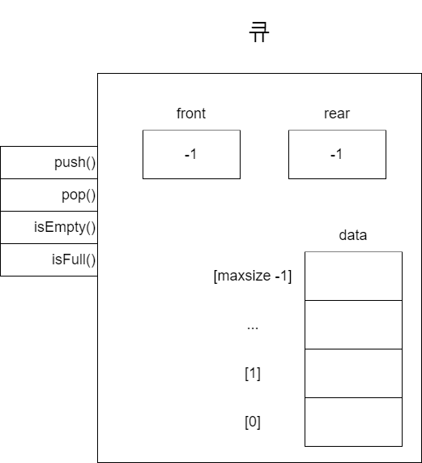
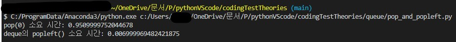

# 큐 개념
큐(queue)는 '줄을 서다'라는 의미에 맞게 먼저 들어간 데이터가 먼저 나오는 자료구조입니다. 이러한 특징을 선입선출 또는 FIFO(First In First Out)이라고 합니다. 스택과 마찬가지로 큐도 삽입 연산을 푸시, 꺼내는 연산을 팝이라고 합니다.

## 큐의 특성을 활용하는 분야
먼저 들어온 것을 먼저 처리하는 큐의 동작 방식은 프로그래밍 언어에서 많이 사용되고 있습니다. 대표적으로 여러 이벤트가 발생했을 때 발생한 순서대로 처리할 때 큐가 활용됩니다.  
* 작업 대기열: 네트워크 통신을 할 때 다수의 클라이언트에서 서버에 작업을 요청하면 서버는 요청이 들어온 순서대로 작업을 처리합니다. 이때 큐를 활용할 수 있습니다.
* 이벤트 처리: 어떤 애플리케이션이나 시스템에서 사용자의 이벤트, 예를 들어 키보드 입력이나 마우스 움직임을 처리할 때 큐를 활용할 수 있습니다.

## 큐의 ADT
큐의 ADT는 다음과 같습니다.  

|구분|정의|설명|
|---|---|---|
|연산|`boolean isFull()`|큐에 들어있는 데이터 개수가 `maxsize`인지 확인해 boolean 값을 반환합니다.|
|연산|`boolean isEmpty()`|큐가 비어있는지 확인해 boolean 값을 반환합니다.|
|연산|`void push(ItemType item)`|큐에 데이터를 푸시합니다.|
|연산|`ItemType pop()`|가장 최근에 푸시한 데이터를 팝하고, 그 데이터를 반환합니다.|
|상태|`int front`|가장 마지막에 큐에 푸시한 데이터의 위치를 기록합니다.|
|상태|`int rear`|가장 최근에 큐에 푸시한 데이터의 위치를 기록합니다.|
|상태|`ItemType data[maxsize]`|큐의 데이터를 관리하는 배열. 최대 `maxsize` 개의 데이터를 관리합니다.|  

  
위 그림의 ADT를 보면, 스택에서 제시했던 그림과 크게 다르지 않습니다. 스택의 `top`이 `front`와 `rear`로 바뀌었을 뿐입니다. `front`는 큐의 앞, `rear`는 큐의 뒤를 의미합니다. 큐는 앞에서 데이터를 빼고(`pop`), 뒤에서 데이터를 넣으므로(`push`) 앞과 뒤의 데이터 최종 위치를 기억할 변수가 필요합니다. 아무 데이터도 넣지 않은 상태에서는 `front`와 `rear`가 모두 -1입니다.  
큐는 `front`의 다음부터 `rear`까지를 자신이 관리하는 데이터로 생각합니다. 그런데 실제 data의 공간이 N개인데 큐가 관리하는 데이터는 N-1개이므로 메모리 공간을 낭비한 상황입니다. 이렇게 된 이유는 큐를 한 방향으로만 관리하고 있기 떄문입니다. 이렇게 하면 `front` 이전의 공간을 활용하지 못합니다. 다시 말해 `front` 이전을 기준으로 큐의 사용할 수 있는 부분과 없는 부분이 나뉘었습니다.

> **큐를 원형으로 개선하기**<br/>위 문제를 개선하려면 선형이 아닌 다른 형태의 큐가 필요합니다. 선형 큐는 front와 rear가 한 방향으로 이동하죠. 이를 개선한 큐는 **원형 큐**입니다. 낭비하는 공간을 없애기 위해 원형으로 front와 rear가 회전합니다.  
원형 큐는 선형 큐에 비해 구현이 조금 복잡하지만 메모리 공간을 절약할 수 있다는 장점이 있습니다. 다만 코딩 테스트에서는 파이썬에서 제공하는 리스트를 사용해도 충분합니다. 왜냐하면 파이썬에서는 리스트의 길이를 자동으로(+ 동적으로) 관리하기 때문입니다. 다시 말해 메모리를 효율적으로 쓰기 위해 굳이 원형 큐를 사용할 필요가 없습니다. 다만, 파이썬이 아닌 다른 언어로 코딩 테스트를 본다거나, 이론적인 메모리 효율 관점에서 설명하는 것이 옳다는 의견도 많습니다.  

## 큐 구현하기
큐를 구현하는 방식은 크게 2가지 방식이 있습니다. 첫 번째는 리스트를 활용하는 방식, 두 번째는 덱(deque)을 사용하는 방식입니다.
### 리스트를 활용할 경우
푸시와 팝은 스택에서와 마찬가지로 `append()`, `pop()` 메서드를 활용합니다. 단, 스택과는 달리 `pop()` 메서드에 인수로 0을 넣어야 합니다. 인수를 넣지 않으면 맨 뒤에 있는 원소가 삭제되므로 큐가 아닌 스택을 구현한 셈이 됩니다. 큐는 선입선출(FIFO)이라는 점을 기억하세요.  
```Python
queue = []

# 큐에 데이터 추가
queue.append(1)
queue.append(2)
queue.append(3)

# 큐의 맨 앞 데이터 제거
first_item = queue.pop(0)
print(first_item) # 1

# 큐에 데이터 추가
queue.append(4)
queue.append(5)

# 큐의 맨 앞 데이터 제거
# 큐의 맨 앞 데이터 제거
first_item = queue.pop(0)
print(first_item) # 2
```  
### 덱을 활용할 경우
덱은 Double Ended Queue를 줄인 말로, 양 끝에서 삽입/삭제를 할 수 있는 큐입니다. 양 끝에서 삽입이나 삭제를 할 수 있다는 뜻은, 한 쪽 방향만 사용할 수도 있다는 뜻이겠죠? 이 때문에 큐를 구현할 때는 덱을 사용하는 것이 일반적입니다. 구현도 간편할 뿐더러 덱의 성능이 훨씬 우수합니다.    
```Python
from collections import deque

queue = deque()

# 큐에 데이터 추가
queue.append(1)
queue.append(2)
queue.append(3)

# 큐의 맨 앞 데이터 제거
first_item = queue.popleft()
print(first_item) # 1

# 큐에 데이터 추가
queue.append(4)
queue.append(5)

# 큐의 맨 앞 데이터 제거
# 큐의 맨 앞 데이터 제거
first_item = queue.popleft()
print(first_item) # 2
```  
> **`pop(0)`과 `popleft()`의 성능 비교**<br/>다음 코드를 입력해보면서 실제로 `pop(0)`이 `popleft()`보다 얼마나 느린지 확인해봅시다. 10만 개의 데이터를 넣은 리스트와 덱을 준비하고 각각 `pop(0)`과 `popleft()` 연산을 합니다. 실제 실행 결과를 보면 `pop(0)`을 10만 번 한 결과는 0.951초, `popleft()`를 10만 번 수행한 결과는 0.007초로 120배 가까이 차이납니다.  
```Python
from collections import deque
import time

lst = list(range(100000))
dq = deque(range(100000))

# pop(0) 성능 측정
start_time = time.time()
for i in range(100000):
    lst.pop(0)
print("pop(0) 소요 시간:", time.time() - start_time)

# popleft() 성능 측정
start_time = time.time()
for i in range(100000):
    dq.popleft()
print("deque의 popleft() 소요 시간:", time.time() - start_time)
```  
