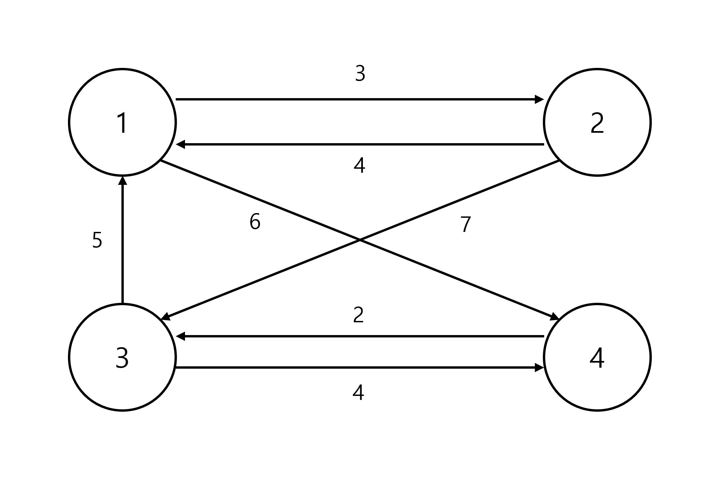
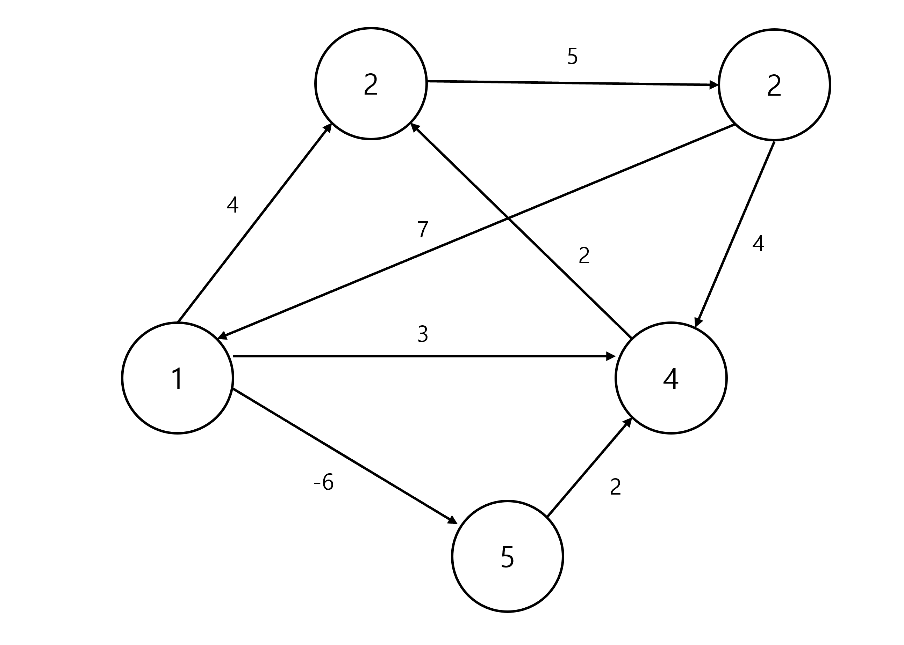

# 최단 경로 알고리즘
Shortest path algorithm. 길 찾기 문제라고도 불립니다. 최단 경로 알고리즘 유형에는 다양한 종류가 있고, 상황에 맞는 효율적인 알고리즘이 이미 정립되어 있습니다. '한 지점에서 다른 특정 지점까지의 최단 경로를 구하는 경우', '모든 지점에서 다른 모든 지점까지의 최단 경로를 모두 구해야 하는 경우' 등이죠.  
일반적으로 최단 경로 문제는 그래프 자료구조를 이용해 표현합니다. 이 경우 각 지점이 그래프의 노드에 해당하고, 지점 간 연결된 경로가 간선(에지)에 해당합니다. 실제 코딩 테스트에서는 최단 경로를 모두 출력하는 문제보다는 단순히 최단 거리를 출력하도록 요구하는 문제가 많이 나옵니다.  
컴공과 학부 수준에서는 보통 **다익스트라 알고리즘**, **플로이드 워셜 알고리즘** 그리고 **벨만-포드 알고리즘**의 3가지가 사용됩니다. 이 중에서 다익스트라 알고리즘과 플로이드 워셜 알고리즘이 코딩 테스트에 가장 많이 등장하는 유형입니다.  
참고로 그리디 알고리즘과 다이나믹 프로그래밍은 최단 경로 알고리즘에 그대로 적용됩니다. 다시 말해 최단 경로 알고리즘은 어떤 의미에서는 이 두 알고리즘의 유형으로 볼 수 있는 것입니다.
## 다익스트라 알고리즘
Dijkstra algorithm. 에츠허르 다익스트라(Edsger Wybe Dijkstra) 교수가 최초로 발표한 알고리즘으로, 실제 GPS 소프트웨어의 기본 알고리즘으로 채택되는 알고리즘입니다. 이 알고리즘은 기본적으로 그리디 알고리즘으로 분류됩니다. 왜냐하면 매번 가장 비용이 적은 노드를 선택해서 일련의 과정을 반복하기 때문입니다. 이 일련의 과정은 아래와 같습니다.  
1. 출발 노드를 설정한다.
2. 최단 거리 테이블을 초기화한다.
3. 방문하지 않은 노드 중 최단 거리가 가장 짧은 노드를 선택한다.
4. 해당 노드를 거쳐 다른 노드로 가는 비용을 계산해 최단 거리 테이블을 갱신한다.
5. 3번 과정과 4번 과정을 초기화한다.

다익스트라 알고리즘은 최단 경로를 구하는 과정에서 **각 노드에 대한 현재까지의 최단 거리 정보를 항상 1차원 리스트에 저장하며 리스트를 계속 갱신한다**는 특징이 있습니다. 이 1차원 리스트를 *최단 거리 테이블*이라고도 합니다. 매번 현재 처리하고 있는 노드를 기준으로 주변 간선을 확인합니다. 나중에 현재 처리하고 있는 노드와 인접한 노드로 도달하는 더 짧은 경로를 찾으면 그제서야 '이제부터는 이 경로가 제일 짧은 경로다'라고 판단하는 것이죠. 따라서 *방문하지 않은 노드 중 현재 최단 거리가 가장 짧은 노드를 확인*해 4번 과정을 수행한다는 점에서는 그리디 알고리즘으로 볼 수 있는 것입니다.  
다익스트라 알고리즘을 구현하는 방법은 2가지가 있습니다.  
1. 구현하기 쉽지만 느리게 동작하는 코드(다익스트라 교수가 최초로 발표한 알고리즘이 이 버전입니다)
2. 구현하기 조금 어렵지만 빠르게 동작하는 코드  

코딩 테스트를 준비하는 입장에서는 2번 방법을 집중적으로 연습해야 합니다.  
### 방법 1. 간단한 다익스트라 알고리즘
처음에 각 노드에 대한 최단 거리를 담는 1차원 리스트(최단 거리 테이블)을 선언합니다. 이후 단계마다 **방문하지 않은 노드 중에서 최단 거리가 가장 짧은 노드를 선택**하기 위해 매 단계마다 최단 거리 테이블의 모든 원소를 순차 탐색합니다.  
앞서 다익스트라 알고리즘을 '최단 경로'를 구하는 알고리즘이라고 소개했는데 여기서는 최단 거리만을 저장하고 있죠? 사실 완벽한 형태의 '최단 경로'를 구하려면 코드를 조금 수정해야 합니다. 코딩 테스트에서는 보통 특정 노드에서 다른 특정 노드까지의 최단 거리만을 출력하도록 요청하므로 거기까지는 다루지 않은 것입니다.  
```Python
import sys
input = sys.stdin.readline
INF = int(1e9)  # 무한대를 의미하는 적당히 큰 수를 설정합니다.

# 노드와 간선의 개수 입력
n, m = map(int, input().split())
# 시작 노드 번호 입력
start = int(input())
# 각 노드에 연결되어 있는 노드에 대한 정보를 담는 리스트 생성
graph = [[] for _ in range(n + 1)]
# 방문 여부 체크 리스트
visited = [False] * (n + 1)
# 최단 거리 테이블을 무한대로 초기화
distance = [INF] * (n + 1)

# 모든 간선 정보 입력
for _ in range(m):
    a, b, c = map(int, input().split())
    # a번 노드에서 b번 노드로 가는 비용이 c라는 의미
    graph[a].append((b, c))


# 방문하지 않은 노드 중, 가장 최단 거리가 짧은 노드의 번호 반환
def get_smallest_node():
    min_value = INF
    index = 0  # 가장 최단 거리가 짧은 노드(인덱스) - 0으로 초기화
    for i in range(1, n + 1):
        if distance[i] < min_value and not visited[i]:
            min_value = distance[i]
            index = i
    return index


# 다익스트라 알고리즘 본체
def dijkstra(start):
    # 시작 노드에 대하여 초기화
    distance[start] = 0
    visited[start] = True
    for j in graph[start]:
        distance[j[0]] = j[1]
    # 시작 노드를 제외한 전체 n - 1개의 노드에 대해 반복
    for i in range(n - 1):
        # 현재 최단 거리가 가장 짧은 노드를 꺼내서 방문 처리
        now = get_smallest_node()
        visited[now] = True
        # 현재 노드와 연결된 다른 노드를 확인
        for j in graph[now]:
            cost = distance[now] + j[1]
            # 현재 노드를 거쳐서 다른 노드로 이동하는 거리가 더 짧은 경우
            if cost < distance[j[0]]:
                distance[j[0]] = cost


# 다익스트라 알고리즘 적용
dijkstra(start)

# 모든 노드로 가기 위한 최단 거리 출력
for i in range(1, n + 1):
    # 도달할 수 없는 경우, 무한(INFINITY)이라고 출력
    if distance[i] == INF:
        print("INFINITY")
    # 도달할 수 있는 경우 거리를 출력
    else:
        print(distance[i])
```  
#### 시간 복잡도
노드의 개수를 $V$라고 할 때, 간단한 다익스트라 알고리즘의 시간 복잡도는 $O\left(V^2\right)$입니다. 왜나하면 총 $O\left(V\right)$번에 걸쳐서 최단 거리가 가장 짧은 노드를 매번 선형 탐색해야 하고, 현재 노드와 연결된 노드를 매번 일일이 확인하기 때문입니다.  
이 때문에 간단한 다익스트라 알고리즘을 적용할 경우 노드의 개수가 10,000개를 넘어가면 시간 제한에 걸려 문제를 해결하기 어려워집니다. 따라서 노드와 간선의 개수가 많아지면 앞에서 말했던 두 번째 방법을 사용해야 합니다.

### 방법 2. 개선된 다익스트라 알고리즘
노드의 개수를 $V$, 간선의 개수를 $E$라고 하면, 개선된 다익스트라 알고리즘에서는 최악의 경우에도 시간 복잡도 $O\left(E\log V\right)$를 보장합니다. 어떻게 이것이 가능할까요?  
간단한 다익스트라 알고리즘에서 매번 최단 거리 테이블을 선형적으로, 순차적으로 탐색했던 것을 기억할 겁니다. 이 과정에서만 $O\left(V\right)$의 시간이 소모되었죠. 하지만 최단 거리가 가장 짧은 노드를 더 빠르게 찾을 수 있는 방법이 있다면 어떨까요? 이 방법을 사용하기 위해 힙(Heap) 자료구조를 사용합니다. 힙 정렬 알고리즘에서 언급했던 바로 그 자료구조입니다. 힙 자료구조의 특성 상 최단 거리의 노드를 탐색하는 데 선형 시간이 아니라 로그 시간이 걸리는 점에 착안한 아이디어죠.  
#### 힙 자료구조
그럼 본격적으로 개선된 알고리즘을 알아보기에 앞서, 힙 자료구조에 대해 짚고 넘어가겠습니다. 사실 힙 자료구조는 **우선순위 큐**(priority queue) 자료구조를 구현하기 위해 사용하는 자료구조입니다. DFS와 BFS를 배울 때 각각 스택과 큐를 이용했던 것 기억나나요? 스택은 먼저 들어온 자료가 나중에 나가는 FILO 자료구조이고, 큐는 먼저 들어온 자료가 나중에 나가는 FIFO 자료구조였죠. 우선순위 큐는 특이하게도 **우선순위가 높은 데이터를 먼저 내보내는** 특징이 있습니다.  
파이썬을 포함한 대부분의 프로그래밍 언어는 우선순위 큐 라이브러리를 지원하기 때문에 밑바닥에서부터 구현할 필요는 없습니다. 파이썬에는 우선순위 큐를 지원하는 라이브러리가 두 가지 존재하는데, `PriorityQueue`와 `heapq`가 그것입니다. 다만 일반적으로는 `heapq`가 더 빠르기 때문에 이 쪽을 집중적으로 사용하게 됩니다. 아, 그렇다고 해서 시간 복잡도 면에서까지 손해라는 것은 아닙니다. 두 라이브러리 모두 시간 복잡도 $O\left(\log N\right)$를 보장합니다.  
우선순위 값을 표현할 때는 일반적으로 정수형 변수를 사용합니다. 예를 들어 물건 정보가 있고, 이 물건 정보가 물건의 가격과 무게로만 구성된다고 해보죠. 그러면 모든 물건 데이터를 `(가격, 무게)`로 묶어서 우선순위 큐에 넣을 수 있습니다. 이후 우선순위 큐에서 물건을 꺼내면, 항상 가격이 높은 물건이 먼저 나오게 할 수 있습니다. 대부분의 프로그래밍 언어에서는 우선순위 큐 라이브러리에 데이터 묶음을 넣으면, 첫 번째 원소를 기준으로 우선순위를 설정합니다. 그래서 이 경우에는 가격이 우선순위 값이 된 것이죠.  
우선순위 큐를 구현할 때는 내부적으로 최소 힙(min heap)과 최대 힙(max heap) 중 하나를 이용합니다. 최소 힙을 이용할 경우 **값이 가장 낮은 데이터를 먼저 추출**하고, 최대 힙에서는 반대로 **값이 가장 높은 데이터를 먼저 추출**합니다. 파이썬의 `heapq` 라이브러리는 최소 힙을 이용하는 케이스에 해당합니다. 그래서 비용이 적은 노드에 높은 우선순위를 부여하는 다익스트라 알고리즘에 그대로 사용하기에 적합합니다.
> C++에서는 최대 힙, 자바에서는 최소 힙을 사용하여 우선순위 큐 라이브러리가 구현되어 있습니다.  

또한, 최소 힙을 최대 힙처럼 사용하기 위해 일부러 우선순위에 해당하는 값에 음수 부호(-)를 붙이는 테크닉이 있습니다. 해당 데이터를 추출한 후에 다시 음수 부호를 제거해 원래 값으로 복원시키거나, 아예 우선순위 큐에 음수 부호와 원래 값을 함께 저장해두면 됩니다. 코딩 테스트에서 은근히 자주 사용되는 테크닉이니 기억해두면 좋습니다.  
앞서 우선순위 큐를 구현할 때는 힙 자료구조를 이용한다고는 했지만, 사실 우선순위 큐의 구현에는 단순히 리스트만 사용해도 됩니다. 하지만 시간 복잡도를 비교해보면, 힙 자료구조를 이용해서 구현할 때가 삭제 시간에서 우위를 갖기 때문에 힙을 사용하는 것입니다.  

|구현 방식|삽입 시간|삭제 시간|
|---|---|---|
|리스트|$O\left(1\right)$|$O\left(N\right)$|
|힙|$O\left(\log N\right)$|$O\left(\log N\right)$|  

-----------
그럼 이를 이용해서 다익스트라 알고리즘을 개선해보겠습니다.  
```Python
import heapq
import sys
input = sys.stdin.readline
INF = int(1e9)  # 무한대를 의미하는 적당히 큰 수를 설정합니다.

# 노드와 간선의 개수 입력
n, m = map(int, input().split())
# 시작 노드 번호 입력
start = int(input())
# 각 노드에 연결되어 있는 노드에 대한 정보를 담는 리스트 생성
graph = [[] for _ in range(n + 1)]
# 방문 여부 체크 리스트
visited = [False] * (n + 1)
# 최단 거리 테이블을 무한대로 초기화
distance = [INF] * (n + 1)

# 모든 간선 정보 입력
for _ in range(m):
    a, b, c = map(int, input().split())
    # a번 노드에서 b번 노드로 가는 비용이 c라는 의미
    graph[a].append((b, c))


# 개선된 다익스트라 알고리즘 본체
def dijkstra(start):
    q = []
    # 시작 노드로 가기 위한 최단 경로를 0으로 설정해 큐에 삽입
    heapq.heappush(q, (0, start))
    distance[start] = 0
    # 큐가 비어있지 않다면 계속 실행
    while q:
        # 가장 최단 거리가 짧은 노드에 대한 정보 꺼내기
        dist, now = heapq.heappop(q)
        # 현재 노드가 이미 처리된 적이 있다면 무시
        if distance[now] < dist:
            continue
        # 현재 노드와 연결된 다른 인접한 노드들을 확인
        for i in graph[now]:
            cost = dist + i[1]
            # 현재 노드를 거쳐서, 다른 노드로 이동하는 거리가 더 짧은 경우
            if cost < distance[i[0]]:
                distance[i[0]] = cost
                heapq.heappush(q, (cost, i[0]))


# 다익스트라 알고리즘 적용
dijkstra(start)

# 모든 노드로 가기 위한 최단 거리 출력
for i in range(1, n + 1):
    # 도달할 수 없는 경우, 무한(INFINITY)이라고 출력
    if distance[i] == INF:
        print("INFINITY")
    # 도달할 수 있는 경우 거리를 출력
    else:
        print(distance[i])
```  
#### 시간 복잡도
앞서 잠시 언급했던 것처럼, 개선된 다익스트라 알고리즘의 시간 복잡도는 $O\left(E\log V\right)$가 보장됩니다.
> **음의 가중치가 있는 그래프에서 다익스트라 알고리즘의 작동**  
결론부터 말하자면, 다익스트라 알고리즘은 양의 가중치만 있는 그래프에서만 동작할 수 있습니다.  
다익스트라 알고리즘은 시작 노드에서 각 노드까지의 최소 비용을 갱신하는 과정을 반복합니다. 현재까지 구한 각 노드의 최소 비용 중 가장 작은 노드를 선택해 움직입니다. 그런데 한 번 방문한 노드는 다시 방문하지 않기 때문에 음의 가중치가 있는 그래프에서 제대로 동작하지 않는 것입니다.  
그럼에도 대부분의 경우 음의 가중치를 갖는 그래프가 많지 않고, 다익스트라 알고리즘 자체 성능이 매우 뛰어나기 때문에 이 알고리즘을 많이 사용하게 됩니다.

## 플로이드 워셜 알고리즘
Floyd-Warshall algorithm. **모든 지점에서 다른 모든 지점까지의 최단 경로를 모두 구해야 하는 경우**에 사용하는 알고리즘입니다. 소스코드가 다익스트라 알고리즘에 비해 간단해서 구현은 쉽지만, 핵심 아이디어를 잘 이해해야 합니다.  
### 다익스트라 알고리즘 vs. 플로이드-워셜 알고리즘
1. 다익스트라 알고리즘과 마찬가지로 플로이드-워셜 알고리즘도 단계마다 거쳐 가는 노드를 기준으로 알고리즘을 수행합니다. 하지만 매번 방문하지 않은 노드 중 최단 거리를 갖는 노드를 찾을 필요가 없다는 차이점이 있습니다. 노드가 $N$개일 때, 알고리즘 상으로 $N$번의 단계를 수행하며, 단계마다 $O\left(N^2\right)$의 연산을 통해 현재 노드를 거쳐 가는 모든 경로를 고려합니다. **따라서 이 알고리즘의 총 시간 복잡도는 $O\left(N^3\right)$입니다.**  
2. 플로이드 워셜 알고리즘은 **2차원 리스트에 최단 거리 정보를 저장**한다는 차이점도 존재합니다. 모든 노드에 대하여 다른 모든 노드로 가는 최단 거리 정보를 담아야 하기 때문이죠. 다시 말해 2차원 리스트를 처리해야 하므로 $N$번의 단계에서 매번 $O\left(N^2\right)$의 시간이 소요됩니다.  
3. 다익스트라 알고리즘이 그리디 알고리즘에 해당한다면, 플로이드-워셜 알고리즘은 **다이나믹 프로그래밍**이라는 차이점이 있습니다. 노드가 $N$개라고 할 때, $N$번의 단계를 반복하며 *점화식에 맞게* 2차원 리스트를 갱신하기 때문에 다이나믹 프로그래밍으로 볼 수 있습니다.  
4. 다익스트라 알고리즘은 그래프 간선의 모든 가중치가 양수일 때만 사용 가능합니다. 반대로 플로이드-워셜 알고리즘은 간선의 가중치가 음수인 경우에도 사용할 수 있습니다.
### 플로이드-워셜 알고리즘의 수행
각 단계에서는 해당 노드를 거쳐 가는 경우를 고려합니다. 예를 들어 1번 노드에 대해서 확인할 때는 1번 노드를 중간에 거쳐 지나가는 모든 경우를 고려합니다.  
예를 들어, 현재 최단 거리 테이블에서 A번 노드 → B번 노드로 가는 비용이 3으로 기록되어 있을 때, A번 노드 → 1번 노드 → B번 노드로 이동하는 비용이 2라는 것이 밝혀지면, A번 노드에서 B번 노드로 가는 비용을 2로 갱신하는 것이죠.
따라서 알고리즘에서는 현재 확인하고 있는 노드를 제외하고, $N-1$개의 서로 다른 노드 순서쌍 $\left(A, B\right)$를 선택합니다. 이후에 A번 노드 → 1번 노드 → B번 노드로 가는 비용을 확인하고 최단 거리를 갱신합니다. 다시 말해 $_{N-1}P_2=\left(N-1\right)\times \left(N-2\right)$개의 쌍을 단계마다 반복해서 확인하는 것이죠. 이때 $O\left(_{N-1}P_2\right)$는 $O\left(N^2\right)$이라고 볼 수 있기 때문에 전체 시간 복잡도는 $O\left(N^3\right)$입니다. 구체적으로, $K$번의 단계를 거친다고 하면 점화식은 아래와 같이 표현할 수 있습니다.  
$$D_{ab}=\min\left(D_{ab},\ D_{ak}+D_{kb}\right)$$  
말로 풀어서 설명하면, **'A에서 B로 가는 최소 비용'과 'A에서 K를 거쳐 B로 가는 비용'을 비교하여 더 작은 값으로 갱신하겠다**는 뜻입니다. '바로 이동하는 거리'가 '특정 노드를 거쳐서 이동하는 거리'보다 더 많은 비용을 가진다면 이를 더 짧은 것으로 갱신한다는 것이죠. 전체적으로 3중 반복문을 이용하여 이 점화식에 따라 최단 거리 테이블을 갱신하면 됩니다.  
### 예시
  
이러한 형태의 그래프를 예로 들어보겠습니다.
#### 0단계: 2차원 리스트 초기화
초기 상태에서 연결된 간선들은 단순히 그 값을 채우면 되고, 연결되지 않은 간선에는 무한이라는 값을 넣습니다. 다익스트라 알고리즘 때와 마찬가지로 무한은 적당히 큰 수(예를 들어 `int(1e9)`)로 설정합니다. 이 2차원 리스트에서 각 값에 해당하는 $D_{ab}$는 a에서 b로 가는 최단 거리입니다.  
예를 들어 1번 노드에서 4번 노드로 가는 비용은 6이기 때문에 2차원 리스트의 첫 번째 행 - 네 번째 열의 값은 6이 됩니다. 자기 자신으로 가는 비용은 0이므로 $1\le i \le n$의 범위를 가지는 모든 $i$에 대하여 $D_{ii}$는 0이라는 값으로 초기화합니다. 즉, 2차원 리스트의 모든 대각성분이 0이 됩니다.  
```Python
[[0, 4, INF, 6],
[3, 0, 7, INF],
[5, INF, 0, 4],
[INF, INF, 2, 0]]
```  
#### 1단계: 1번 노드를 거쳐 가는 경우
1단계에서는 단순히 1번 노드를 거쳐 가는 경우를 고려합니다. 이때는 정확히 다음과 같이 $_3P_2=6$가지 경우만 고민하면 됩니다.  
$$D_{23}=\min\left(D_{23},\ D_{21}+D_{13}\right)$$  
$$D_{24}=\min\left(D_{24},\ D_{21}+D_{14}\right)$$  
$$D_{32}=\min\left(D_{32},\ D_{31}+D_{12}\right)$$  
$$D_{34}=\min\left(D_{34},\ D_{31}+D_{14}\right)$$  
$$D_{42}=\min\left(D_{42},\ D_{41}+D_{12}\right)$$  
$$D_{43}=\min\left(D_{43},\ D_{41}+D_{13}\right)$$  
이 6가지 경우만 하나씩 확인하면서 값을 계산하여 갱신합니다. 다시 한 번 위의 6개의 식을 말로 풀어서 설명하자면, 1번 노드를 거쳐 갈 때가 더 빠른 경우가 존재한다면 빠른 경우로 최단 거리를 갱신해줍니다. 이렇게 6개의 식을 모두 계산해서 값을 갱신하면 테이블은 아래와 같이 변합니다.  
```Python
[[0, 4, INF, 6],
[3, 0, 7, 9],
[5, 9, 0, 4],
[INF, INF, 2, 0]]
```  
#### 2단계: 2번 노드를 거쳐 가는 경우
같은 방식으로 2번 노드를 거쳐 가는 경우에 대해서도 연산할 수 있습니다. 그러면 테이블이 아래와 같이 바뀝니다.  
```Python
[[0, 4, 11, 6],
[3, 0, 7, 9],
[5, 9, 0, 4],
[INF, INF, 2, 0]]
```  
#### 3단계: 3번 노드를 거쳐 가는 경우
마찬가지로 3번 노드를 거쳐 가는 경우를 연산하면 다음과 같이 테이블이 바뀝니다.  
```Python
[[0, 4, 11, 6],
[3, 0, 7, 9],
[5, 9, 0, 4],
[7, 11, 2, 0]]
```  
#### 4단계: 4번 노드를 거쳐 가는 경우
주어진 그래프에서 노드의 개수가 4개이므로 이 단계가 마지막 단계가 되겠습니다. 테이블을 갱신하면 아래와 같이 바뀝니다.  
```Python
[[0, 4, 8, 6],
[3, 0, 7, 9],
[5, 9, 0, 4],
[7, 11, 2, 0]]
```  
#### 최종 결과
4단계까지 마친 테이블이 최종 테이블입니다. 여기 기록되어 있는 내용이 모든 노드에서 모든 노드로 가는 최단 거리 정보를 표현하고 있습니다. 예를 들어 $D_{13}$(1행 3열)은 8이라는 값을 가지고 있는데, 이는 1번 노드에서 3번 노드로 가는 최단 거리 8이라는 뜻입니다.  
### 코드 구현
```Python
INF = int(1e9)

n, m = map(int, input().split())
# 2차원 리스트(그래프 표현)을 만들고, 모든 값을 무한으로 초기화
graph = [[INF] * (n + 1) for _ in range(n + 1)]

# 자기 자신에서 자기 자신으로 가는 비용은 0으로 초기화
for a in range(1, n + 1):
    for b in range(1, n + 1):
        if a == b:
            graph[a][b] = 0

# 각 간선에 대한 정보를 입력받아, 그 값으로 초기화
for _ in range(m):
    a, b, c = map(int, input().split())
    graph[a][b] = c

# 점화식에 따라 플로이드-워셜 알고리즘 수행
for k in range(1, n + 1):
    for a in range(1, n + 1):
        for b in range(1, n + 1):
            graph[a][b] = min(graph[a][b],
                              graph[a][k] + graph[k][b])

# 수행된 결과 출력
for a in range(1, n + 1):
    for b in range(1, n + 1):
        # 도달할 수 없는 경우, 무한(INFINITY)이라고 출력
        if graph[a][b] == INF:
            print("INFINITY", end=" ")
        else:
            print(graph[a][b], end=" ")
    print()
```  
## 벨만-포드 알고리즘
코딩 테스트에서는 일반적으로 상술한 다익스트라 알고리즘과 플로이드-워셜 알고리즘이 주로 출제됩니다. 하지만 컴공과 학부 과정에서는 세 번째 알고리즘인 벨만-포드 알고리즘(Bellman-Ford algorithm)까지 다루기 때문에 기술 면접을 대비하기 위해 알아두는 것이 도움이 됩니다.  
벨만-포드 알고리즘은 노드에서 노드까지의 최소 비용을 구한다는 점에서 다익스트라 알고리즘과 유사합니다. 하지만 **매 단계마다 모든 간선의 가중치를 다시 확인하여 최소 비용을 갱신하므로 음의 가중치를 갖는 그래프에서도 최단 경로를 구할 수 있습니다**. 이 알고리즘은 글로만 읽으면 쉽게 와닿지 않기 때문에 동작 과정을 자세히 살펴볼 필요가 있습니다.
### 수행 단계
일단 수행 과정을 정리하면 아래와 같습니다.
1. 시작 노드를 설정하고, 시작 노드의 최소 비용은 0, 나머지 노드는 무한으로 초기화한다. 이후 최소 비용을 갱신할 때 직전 노드도 갱신한다.
2. 노드 개수가 $N$개일 때, 아래 연산을 $N-1$회 실행한다.
    1. 시작 노드에서 갈 수 있는 각 노드에 대하여 전체 노드 각각을 거쳐갈 때 현재까지 구한 최소 비용보다 더 적은 최소 비용이 있는지 확인하여 갱신한다.
    2. 최소 비용을 갱신할 때, V의 직전 노드 값도 같이 갱신한다.
3. 2번 과정을 마지막으로 한 번 더 수행해 갱신되는 최소 비용이 있는지 확인한다.

직관적으로 이해되지 않는 부분을 정리해서 설명해보죠.
#### $N-1$회 반복하는 이유
매 연산마다 최단 경로가 1개씩 확정되기 때문입니다.  
벨만-포드 알고리즘이 연산을 $K$번 반복하면 $K$개의 간선에 대한 최단 경로를 구할 수 있습니다. 이런 식으로 $N-1$번 연산을 반복하면 $N$번 노드에 대한 최단 경로가 결정되므로 벨만-포드 알고리즘이 종료됩니다.  
#### 마지막에 한 번 더 연산을 반복하는 이유
여기서 $N-1$회 연산을 반복해서 이미 모든 노드에 대한 최단 경로가 구성된 것을 확인했습니다. 하지만 여기서 한 번 더 연산을 반복했을 때, $N$번 노드의 최단 경로를 구성하는 간선의 개수가 N개 이상이라면 어딘가 잘못된 것이 있음을 눈치챌 수 있을 겁니다. 이는 **그래프 내에 음의 순환이 있음**을 나타내는 신호입니다.  
음의 순환 구간을 반복하면 계속해서 최소 비용(즉, 가중치의 합)이 줄어듭니다. 최소 비용은 이 순환을 돌면서 무한히 작아지기 때문에 최단 경로를 구할 수 없습니다. 따라서 음의 순환이 있음을 알 수 있는 것입니다.  
하지만 그렇다고 해서 벨만-포드 알고리즘이 음의 순환이 있을 때 최단 경로를 구하지 못한다고 오해해서는 안 됩니다! 엄밀히 말하면 그래프에 음의 순환이 있으면 어떤 알고리즘이라도 최단 경로를 구할 수 없습니다. 다만 벨만-포드 알고리즘처럼 음의 가중치를 다루는 최단 경로 알고리즘은 음의 순환에 빠질 수 있을 뿐 음의 가중치가 있는 그래프에서도 최단 경로를 찾을 수는 있게끔 만들어졌습니다. 오히려 음의 순환을 *감지*할 수 있는 이점도 있습니다. 다익스트라 알고리즘은 아예 음의 가중치가 있는 그래프에서 동작하지 못하기 때문에 언급되지 않을 뿐입니다.  
### 예시
  
위와 같은 그래프를 예시로 들어보겠습니다.
#### 1단계: 시작 노드 설정 및 테이블 초기화
시작 노드를 1번 노드로 정해보겠습니다. 그러면 테이블에서 1번 노드의 최소 비용을 0, 직전 노드를 A, 나머지 노드의 비용을 무한으로 초기화합니다.  

|노드|1|2|3|4|5|
|---|---|---|---|---|---|
|최소 비용|0|INF|INF|INF|INF|
|직전 노드|1|INF|INF|INF|INF|  

#### 2단계: 1번 노드를 거쳐 가는 비용 갱신
1번 노드에서 1번 노드를 거쳐 2~5번까지의 노드로 가는 비용 중 현재까지 구한 최소 비용보다 적은 값이 있는지 확인합니다. 이때 현재까지 구한 최소 비용보다 비용이 적다면 갱신합니다. 간선이 없는 경우는 무한으로 취급합니다.  

|노드|1|2|3|4|5|
|---|---|---|---|---|---|
|최소 비용|0|4|3|INF|-6|
|직전 노드|1|1|1|INF|1|  

#### 3단계: 1번 노드에서 2번 노드를 거쳐 가는 비용 갱신
|노드|1|2|3|4|5|
|---|---|---|---|---|---|
|최소 비용|0|4|3|9|-6|
|직전 노드|1|1|1|2|1|  
#### 4단계: 1번 노드에서 3번 노드를 거쳐 가는 비용 갱신  
3번 노드를 거쳐서 2번 노드로 가는 새 경로는 기존 2번 노드의 최소 비용보다 크므로 갱신하지 않습니다.  

|노드|1|2|3|4|5|
|---|---|---|---|---|---|
|최소 비용|0|4|3|9|-6|
|직전 노드|1|1|1|2|1|  
#### 5단계: 1번 노드에서 5번 노드를 거쳐 가는 비용 갱신  
1번 노드와 4번 노드는 연결된 간선이 없으므로 넘어갑니다. 곧바로 5번 노드를 거쳐 가는 비용을 갱신해보겠습니다.  

|노드|1|2|3|4|5|
|---|---|---|---|---|---|
|최소 비용|0|4|-4|9|-6|
|직전 노드|1|1|5|2|1|  

이로써 첫 번째 반복이 끝났습니다. 위 과정을 $N-1$회 반복하므로 위 단계들을 4번 더 반복하면 됩니다.  
#### 6단계: 음의 순환을 찾기 위해 마지막으로 1번 노드에서 1번 노드까지 가는 비용 갱신
연산 자체는 첫 번째 과정과 동일합니다.  

### 시간 복잡도
노드의 개수를 $N$개, 간선의 개수를 $E$개라고 하면, 노드 개수에서 1을 뺀 만큼 최단 경로를 체크하며 필요한 경우 갱신 연산을 합니다. 따라서 시간 복잡도는 $O\left(N\times E\right)$입니다.