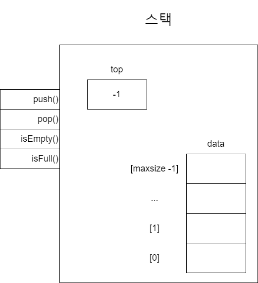

# 스택 개념
스택(Stack)은 쌓는다는 어원에서 알 수 있듯이 **먼저 입력한 데이터를 제일 나중에 꺼낼 수 있는 자료구조**입니다. 먼저 들어간 것이 가장 나중에 나오는 규칙을 선입후출(先入後出), 영어로는 FILO(First In Last Out)이라고 합니다. ~~공군 공정통제사 슬로건~~ 이때 스택에 삽입하는 연산을 *푸시*(push), 꺼내는 연산을 *팝*(pop)이라고 합니다.
# 스택의 정의
스택의 ADT를 정의해보고자 합니다. ADT란 Abstract Data Type의 준말로, 추상 자료형이라는 뜻입니다. 인터페이스만 있고 실제로 구현은 되지 않은 자료형을 ADT라고 부르죠. 쉽게 말해 자료구조의 설계도라고 할 수 있습니다.  
> 언어에 따라 표준 라이브러리에서 어떤 자료구조를 제공하는지의 여부가 다릅니다. 파이썬은 스택을 제공하지는 않지만, 대안으로 리스트의 메서드인 `append()`, `push()`를 이용해 스택을 모사할 수 있습니다.  
> 한쪽으로만 데이터를 삽입/삭제할 수 있는 스택과는 달리, 덱(deque)은 양쪽에서 데이터를 삽입하거나 삭제할 수 있는 자료구조입니다. 덱의 특성을 조금만 응용하면 스택처럼 사용할 수 있습니다. 덱은 파이썬 표준 라이브러리 `collections`에서 `deque`을 임포트해서 사용할 수 있습니다.  

## 스택의 ADT
스택에는 푸시(push), 팝(pop), 가득 찼는지 확인(isFull), 비었는지 확인(isEmpty)와 같은 연산이 필요합니다. 또한 최근에 삽입한 데이터의 위치를 저장할 변수인 탑(top)도 필요합니다.  

|구분|정의|설명|
|---|---|---|
|연산|`boolean isFull()`|스택에 들어있는 데이터 개수가 `maxsize`인지 확인해 boolean 값을 반환합니다. 가득 차 있다면 `True`, 아니면 `False`입니다.|
|연산|`boolean isEmpty()`|스택이 비어있는지 확인해 boolean 값을 반환합니다. 완전히 비어 있다면 `True`, 아니면 `False`입니다.|
|연산|`void push(ItemType item)`|스택에 데이터를 푸시합니다.|
|연산|`ItemType pop()`|가장 최근에 푸시한 데이터를 팝하고, 그 데이터를 반환합니다.|
|상태|`int top`|가장 최근에 스택에 푸시한 데이터의 위치를 기록합니다.|
|상태|`ItemType data[maxsize]`|스택의 데이터를 관리하는 배열. 최대 `maxsize` 개의 데이터를 관리합니다.|  

  

위 그림은 스택의 ADT를 나타낸 것입니다. 스택 외부와 내부에 네모 모양으로 표현한 연산과 상태가 보입니다. 이 그림에서 연산 시 해야 할 동작과 상태가 가지고 있어야 할 값을 정의하고 있습니다. 그러나 세부 구현 내용, 즉, **프로그래밍 언어는 무엇을 사용해야 하고 데이터는 이렇게 저장해야 한다**는 내용은 없습니다. `data` 배열을 보면 최대 크기는 `maxsize`이므로 인덱스의 범위는 0부터 `maxsize - 1`입니다. `top`은 가장 최근에 추가한 데이터의 위치를 참조합니다.ㅣ 지금 그림에는 아무 데이터도 없으므로 `top`에 `-1`이 들어 있습니다. 만약 `top`이 0이면 데이터가 1개 있는 것이므로 초기값을 0이 아니라 -1로 했음에 주목하세요.  

## 스택 구현하기
코딩 테스트에서는 "이 문제에 이 자료구조를 써라!"라고 명시해놓는 경우가 없기 때문에 문제에 적용할 자료구조 혹은 알고리즘을 파악하는 능력이 중요합니다. 문제에서 의도한 데이터 흐름이 스택에 맞는지를 알아차리는 것이 중요하죠. 예를 들어 데이터를 그냥 저장하고 순서와 상관 없이 임의 접근하기만 해도 충분하면 배열을 사용하면 됩니다. 그러나 최근에 삽입한 데이터를 대상으로 뭔가 연산을 해야 한다면 스택을 떠올리는 것이 좋습니다. 앞서 정의한 스택 ADT를 파이썬에서 구현하면 다음과 같습니다.  
```Python
stack = [] # 스택으로 사용할 리스트 초기화
max_size = 10 # 스택의 최대 크기

def isFull(stack):
    # 스택이 가득 찼는지 확인하는 함수
    return len(stack) == max_size

def isEmpty(stack):
    # 스택이 비어 있는지 확인하는 함수
    return len(stack) == 0

def push(stack, item):
    # 스택에 데이터를 추가하는 함수
    if isFull(stack):
        print("The stack is full.")
    else:
        stack.append(item)
        print("Data pushed into the stack.")
        
def pop(stack):
    # 스택에서 가장 최근에 추가된 데이터를 꺼내는 함수
    if isEmpty(stack):
        print("The stack is empty.")
        return None
    else:
        return stack.pop()
```  

그러나 파이썬의 리스트는 크기를 동적으로 관리하므로 `max_size`나 `isFull()` 함수, `isEmpty()` 함수는 실제 문제를 풀 때 구현하지 않아도 됩니다. 게다가 `push()` 함수와 `pop()` 함수를 보면, 실제 이 함수들이 하는 일이라고는 `append()` 메서드와 `pop()` 메서드를 호출하는 것이 전부합니다. 그러니 `push()` 함수와 `pop()` 함수 구현까지 생략하면 스택의 실제 구현은 아래와 같이 축약됩니다.  
```Python
stack = [] 

# 스택에 데이터 추가
stack.append(1)
stack.append(2)
stack.append(3)

# 스택에서 데이터 꺼냄
top_element = stack.pop()
next_element = stack.pop()

# 스택의 크기 구하기
stack_size = len(stack)

# top_element : 3
# next_element : 2
```  

스택의 개념 자체는 어렵지 않으므로 비교적 쉽게 이해할 수 있습니다. 정작 실전에서 문제를 풀 때 가장 어려운 점은 *"이 문제는 스택을 써야 풀 수 있다"는 점을 간파하지 못하는 것*입니다. 따라서 스택 관련 문제를 많이 풀어보면서 어떤 문제에 스택을 쓰는 것이 적절한 지 감을 잡아가야 합니다.