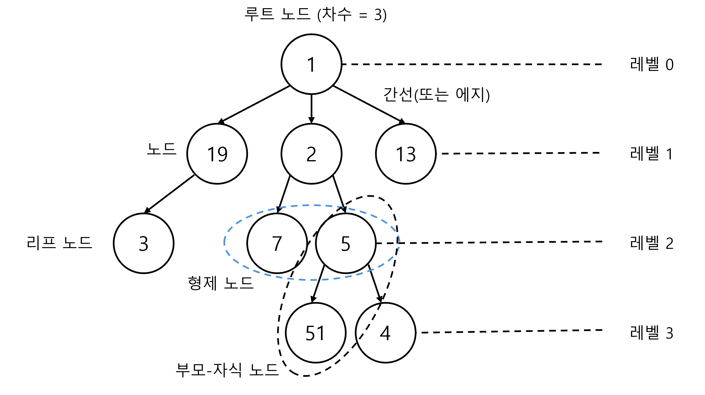
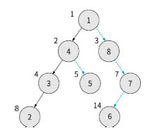
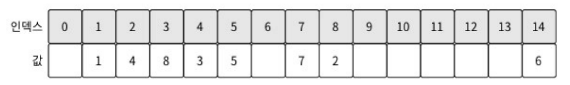
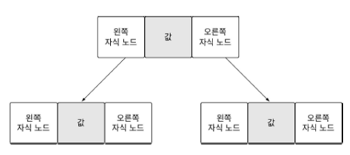
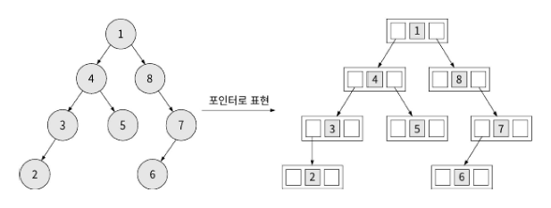

# 트리 개념
트리(tree)는 데이터를 저장하고 탐색하기에 유용한 구조입니다.
## 트리의 특성을 활용하는 분야
트리는 계층 구조를 표현하는 데 특화되어 있습니다. 파일 시스템, 디렉터리 구조 등이 대표적인 예시죠.  
* 인공지능: 인공지능의 판단 기준을 만들 때 결정 트리(decision tree) 모델을 사용하는 경우가 있습니다.
* 자동 완성: 트리는 문자열 처리에도 많이 활용됩니다. 예를 들어, 검색 엔진의 자동 검색어 추천 기능은 트리의 일종인 트라이(trie)라는 자료구조를 활용한 것입니다. 이를 활용해 접두사 또는 패턴 검색을 할 수 있습니다.
* 데이터베이스: 데이터를 쉽게 검색, 삽입, 삭제할 수 있도록 트리를 활용해 데이터를 구조화하고 인덱싱합니다. B- 트리와 B+ 트리를 많이 사용합니다.
## 트리의 형상
트리는 나무 기둥에서 가지가 뻗어나가는 모습을 거꾸로 뒤집은 형상입니다. 따라서 나무 뿌리가 맨 위에 있습니다.  
  
### 노드
노드(node)는 트리를 구성하는 요소입니다. 노드 중 가장 위에 있는 노드를 **루트 노드**(root node)라고 합니다. 위 그림에서는 값 1이 들어있는 노드가 루트 노드입니다.
### 간선 또는 에지
**간선** 또는 **에지**(edge)는 노드와 노드 사이를 이어주는 선입니다. 트리는 노드와 노드가 단방향 간선으로 연결되어 있고, 루트 노드에서 각 노드까지의 경로는 유일합니다.  
루트 노드로부터 특정 노드까지 거쳐가는 최소한의 간선 수를 **레벨**이라고 합니다. 예를 들어 루트 노드는 레벨 0, 노드 19, 2, 13은 레벨 1입니다.
### 부모-자식, 형제 관계
간선으로 연결된 노드들은 **부모-자식 관계**에 있다고 합니다. 이 중 상대적으로 위에 있어 레벨이 낮은 노드를 **부모 노드**(parent node), 아래에 있어 레벨이 높은 노드를 **자식 노드**(child node)라고 합니다.  
또한, 같은 부모 노드를 갖는 노드를 **형제 노드**(sibling node)라 합니다.
### 리프 노드
자식이 없는 노드를 말단 노드 또는 **리프 노드**(leaf node)라고 합니다.
### 간선의 개수, 차수
**차수**(degree)란 특정 노드에서 아래로 향하는 간선의 개수입니다. 예를 들어 노드 1은 아래로 향하는 간선이 3개이기 때문에 차수가 3입니다.  
> 많은 전문가는 트리와 그래프를 이야기할 때 같은 뜻의 서로 다른 용어를 혼용합니다. 현업에서 보편적으로 사용되기는 하지만, 처음 접할 때는 개념이 다소 혼동스러울 수 있습니다. 

# 이진 트리 표현하기
트리의 종류는 매우 다양하지만, 코딩 테스트에서는 이진 트리(binary tree)만 제대로 알고 있어도 됩니다. 이진 트리란 모든 노드의 최대 차수가 2인, 다시 말해 간선이 최대 2개인 트리입니다.  
이진 트리는 배열 또는 포인터로 구현할 수 있습니다.  
## 배열로 표현하기
배열은 선형 자료구조이지만, 트리는 계층 자료구조입니다. 따라서 배열로 트리를 표현할 때는 세 가지 규칙을 적용해야 합니다. 이 규칙에서는 루트 노드를 배열 인덱스 1번으로 놓고 작성합니다.  
* 루트 노드는 배열 인덱스 1번에 저장한다.
* 왼쪽 자식 노드의 배열 인덱스는 부모 노드의 배열 인덱스 $\times$ 2이다.
* 오른쪽 자식 노드의 배열 인덱스는 부모 노드의 배열 인덱스 $\times$ 2 + 1이다.  

  
루트 노드를 인덱스 0으로 하면 왼쪽 자식 노드는 *부모 노드의 배열 인덱스 $\times$ 2 + 1*이 되고, 오른쪽 자식 노드는 *부모 노드의 배열 인덱스 $\times$ 2 + 2*가 됩니다. 입력값에 따라 루트 노드를 0 혹은 1로 정해야 하는 경우가 있으므로 알아두면 편합니다.  
  
트리를 표현한 배열을 보면 빈 값이 꽤 많이 보입니다. 노드들의 부모-자식 관계를 곱셈 연산하여 배열의 인덱스로 사용하기 때문에 실제 노드 개수보다 많은 공간을 사용할 수밖에 없습니다. 즉, 배열로 트리를 표현하면 메모리가 낭비된다는 단점이 있습니다.  
그렇다고 해서 배열 표현 방법이 나쁘다는 건 아닙니다. 이진 트리를 배열로 표현하는 방식은 굉장히 쉽습니다. 따라서 메모리만 넉넉하다면 구현 시간을 단축하는 용도로 좋습니다. 다행히도 대부분의 코딩 테스트에서는 배열로 이진 트리를 구현해도 괜찮은 경우가 많습니다.
> 이진 트리의 노드가 N개일 때, 배열로 이진 트리를 생성하면 $O\left(N\right)$이 걸립니다.  
## 이진 트리 순회하기
순회(traversal)란 어떤 데이터가 있을 때 그 데이터를 빠짐없이 방문하는 것입니다. 트리에서 데이터를 검색하려면 트리를 순회할 수 있어야합니다. 이진 트리에서의 순회는 아래와 같이 총 3가지 방법이 있습니다.  
* 전위 순회(pre-order): **현재 노드를 부모 노드로 생각했을 때** 부모 노드 → 왼쪽 자식 노드 → 오른쪽 자식 노드 순서로 방문.
* 중위 순회(in-order): **현재 노드를 부모 노드로 생각했을 때** 왼쪽 자식 노드 → 부모 노드 → 오른쪽 자식 노드 순서로 방문.
* 후위 순회(post-order): **현재 노드를 부모 노드로 생각했을 때** 왼쪽 자식 노드 → 오른쪽 자식 노드 → 부모 노드 순서로 방문.  

순회에서 주목할 표현은 **현재 노드를 부모 노드로 생각했을 때**입니다. 이 개념을 이해해야 순회를 쉽게 이해할 수 있습니다.  
> 방문: 탐색에서 방문이란 탐색을 마친 상태를 의미합니다. 탐색 과정에서 지나치는 것과 그렇지 않은 것을 구분하기 위해 방문이라는 용어를 사용합니다.  

(아래 문단 이미지 출처: https://gnujoow.github.io/ds/2016/09/01/DS4-TreeTraversal/)

### 전위 순회
  
### 중위 순회
  
### 후위 순회
  
## 포인터로 표현하기
포인터로 트리를 표현하려면 노드부터 정의해야 합니다. 다음 그림처럼 노드는 노드의 값, 왼쪽 자식 노드와 오른쪽 자식 노드를 가집니다.  
  
이 노드 구성을 트리에 적용하면 다음과 같습니다.  
  
포인터로 표현한 트리는 배열과 달리 인덱스 연산을 하지 않으므로 메모리를 낭비하지 않습니다. 하지만 실제 노드를 따라 구현해야 하므로 구현 난이도가 배열로 표현하는 것에 비해 조금 높습니다.
# 이진 트리 탐색하기
이진 트리에서 가장 중요한 것은 **탐색을 효율적으로 할 수 있도록 트리를 구축하는 것**입니다. 여기서는 *이진 탐색 트리*(binary search tree)를 만들고, 이를 활용해 원하는 노드를 효율적으로 찾는 방법을 알아봅시다.
## 이진 탐색 트리 구축하기
이진 탐색 트리는 **데이터 크기를 기준으로 크기가 작으면 왼쪽 자식 위치에, 크거나 같으면 오른쪽 자식 위치에 배치하는 정렬 방식을 사용**합니다. 데이터를 전부 삽입한 다음 정렬하는 것이 아니라, 데이터를 하나씩 삽입하면서 이진 탐색 트리를 구축합니다. 즉, 삽입과 정렬을 동시에 하는 것이죠.
## 이진 탐색 트리 탐색
1. 찾으려는 값이 현재 노드와 같으면 탐색을 종료하고, 크면 오른쪽 노드 탐색.
2. 본인이 찾으려는 값이 현재 노드의 값보다 작으면 왼쪽 노드를 탐색.
3. 값을 찾으면 종료. 노드가 없을 때까지 계속 탐색했는데 값이 없으면 현재 트리에 남은 값이 없는 것.
### 배열 탐색과의 비교
배열 탐색에서는 순차적으로 값을 찾습니다. 때문에 값이 뒤쪽 인덱스에 있을수록 비교 연산을 더 많이 해야 합니다.  
그에 반해 이진 탐색 트리는 노드를 잘 선택하면 더 빨리 찾을 수 있습니다. 이는 이진 탐색 트리의 구축 방식에 기인합니다. 구축 과정에서 이미 **데이터 크기에 따라 하위 데이터 중 한 방향을 검색 대상에서 제외**하므로 검색이 빨라지는 것이죠.
## 이진 탐색 트리의 시간 복잡도
이진 탐색 트리의 시간 복잡도는 *트리 균형*에 기인합니다. 트리의 균형이 잡힌 것은 각 노드의 차수가 비슷하게 유지되면서 각 노드의 자식 노드 수도 비슷하게 유지됨을 말합니다. *일반적으로 왼쪽과 오른쪽 서브 트리의 높이 차가 1 이하인 경우를 칭합니다.* 균형이 유지되었다고 가정했을 때, 삽입과 탐색 연산 시 이진 탐색 트리에 저장된 노드가 N개라고 하면 시간 복잡도는 $O\left(\log N\right)$입니다. 하지만 균형이 맞지 않을 떄는 배열과 비슷해집니다. 특히 한 쪽 자식만 있어서 치우친 형태(일명 degenerate binary tree)로 구축된 경우에는 아예 배열과 같아집니다($O\left(n\right)$).
### 균형 이진 탐색 트리
노드가 치우치지 않도록 균형을 유지하는 트리를 균형 이진 탐색 트리(balanced binary search tree)라고 합니다. 균형 이진 탐색 트리에서는 이진 트리 탐색 연산 횟수가 트리 높이에 비례합니다. 트리의 높이가 $\log N$이므로 시간 복잡도를 $O\left(\log N\right)$로 유지할 수 있습니다. 다만 구현 난이도가 매우 높아서 코딩 테스트에 나올 가능성은 낮은 편입니다.